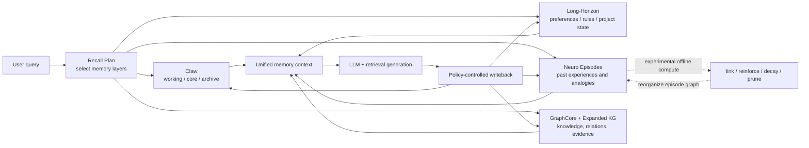

<div align="center">


# DocThinker

**Plastic Memory Runtime · Editable Long-Term Memory · Evidence-Grounded Knowledge Evolution**

*Memory is not only stored. It can be recalled, corrected, connected, and reorganized through use.*

[](https://arxiv.org/pdf/2603.05551)
[](LICENSE)
[](http://localhost:5000)
[](#-plastic-memory-runtime)
[](#-session-scoped-knowledge-graphs-and-evidence-evolution)

[](https://www.python.org/)
[](https://fastapi.tiangolo.com/)
[](https://flask.palletsprojects.com/)
[](https://networkx.org/)
[](https://github.com/facebookresearch/faiss)

[English](README.md) | [中文](README.zh-CN.md)

</div>

---

## Why DocThinker?

Most agent memory systems write records and retrieve similar records later. DocThinker asks a further question: **what happens to a memory after it is written?**

DocThinker organizes conversations, documents, retrieval traces, episodes, and knowledge graphs into a multi-layer memory runtime. It supports cross-turn recall while also making long-term state observable and editable. Experimental offline algorithms can connect related experiences, reinforce useful paths, decay weak links, and prune them over time.

The project has two central directions:

1. **Controllable plastic memory.** Memory is not an append-only black box. Durable rules and preferences can be recalled, updated, replaced, deleted, and audited.
2. **Brain-inspired offline consolidation.** Additional compute outside answer generation reorganizes episodes using content similarity, structural similarity, salience, and graph relations. This module is experimental and is not yet fully integrated into the main Web workflow.

Document reasoning and knowledge graphs remain important sources of memory and evidence, but they are not the project's only identity.

## Capability Status

This README distinguishes production-wired behavior from experimental modules and planned work.

| Status | Capability | Current behavior |
|---|---|---|
| ✅ Wired | Cross-turn rules, preferences, and project state | Can be recalled independently of ordinary chat context |
| ✅ Wired | Memory update and ablation | New rules can replace old rules; memory can be disabled for comparison |
| ✅ Wired | Memory Trace | Exposes recall plans, long-horizon state, episodes, candidate knowledge, and evidence |
| ✅ Wired | Episodic analogy retrieval | Deep mode retrieves experiences by content, structure, and salience |
| ✅ Wired | Tiered conversation memory | Claw working/core/archive hierarchy |
| ✅ Wired | Session-scoped knowledge graph | Each session isolates documents, graph state, indexes, and cache scope |
| ✅ Wired | Memory management API | List, update, delete, edit-plan, and export long-horizon records |
| 🧪 Experimental | Offline memory consolidation | Linking, reinforcement, decay, and pruning exist in code but are not wired to the main UI or scheduler |
| 🧪 Experimental | Inductive abstraction | Summaries, similar-memory merging, and graph clustering exist; a complete observable induction trace does not |
| 🧪 Experimental | KG relation evolution | ECLRR-v4 can propose and review evidence-complete candidate relations |
| 🧭 Planned | Persistent plastic long-term memory | The default Long-Horizon backend is process-local and is lost on restart |
| 🧭 Planned | Unified reasoning traces | Explicit premises, steps, conclusions, and provenance for deduction, induction, and analogy |

> [!IMPORTANT]
> The default `InMemoryLongHorizonBackend` is intended for local demos and interface validation. Production deployments should replace it with a SQLite, vector-database, or graph-database backend.

## How It Works



The online loop is coordinated through `AgentMemoryCore`:

1. Build a recall plan from request controls and query intent.
2. Retrieve candidates from enabled memory layers.
3. Merge memory, graph evidence, and document context into one generation instruction.
4. Generate an answer and record the memory path used for that turn.
5. Write episodes, long-term state, and candidate knowledge back under an explicit memory policy.

<div align="center">

<p><b>Figure 1.</b> AgentMemoryCore, pluggable backends, GraphCore, retrieval/generation, and policy-controlled writeback.</p>
</div>

## 🧠 Plastic Memory Runtime

### 1. AgentMemoryCore

`docthinker.memory_core.AgentMemoryCore` is the unified memory facade. External agents can implement backend protocols for:

- conversation memory;
- episodic memory;
- long-horizon insight memory;
- expanded KG hypotheses;
- graph promotion;
- optional chat-turn ingestion.

`MemoryPolicy` controls active layers, recall breadth, and whether writes are allowed. Hosts can also use `remember_turn=false` or `memory_excluded_layers` to keep sensitive or transient material out of selected memory layers.

### 2. Four Online Memory Layers

| Layer | Default implementation | Purpose |
|---|---|---|
| Conversation memory | Claw | Recent dialogue, core summaries, and cold semantic archives |
| Episodic memory | Neuro Memory | Episode summaries, concepts, entities, relations, and structure for analogy |
| Long-term state | Long-Horizon backend | Preferences, rules, feedback, project state, and reusable experience |
| Semantic/candidate knowledge | GraphCore + Expanded KG | Document facts, evidence relations, and hypotheses awaiting validation |

### 3. Observable and Editable Memory

The Query page exposes a turn-level Memory Trace. The KG dashboard supports listing long-horizon records, natural-language edit planning, confirmed updates, deletion, and export. This makes it possible to distinguish an answer that merely looks plausible from one that actually used a stored memory.

<div align="center">
  
  <p><b>Figure 2.</b> Memory traces, long-term state, and knowledge-graph observability and management.</p>
</div>

## 🧬 Algorithms

### Episodic Analogy Retrieval

Neuro Memory stores each experience as an episode. Its current analogy score combines:

```text
score = 0.60 × content similarity + 0.25 × structural similarity + 0.15 × salience
```

Similar episodes are injected as reasoning guidance, not treated as factual evidence. Factual claims should still be grounded in source chunks or graph evidence.

### Spreading Activation

Recall can propagate through the memory graph for up to three hops. Relation types use different decay factors, while co-activated nodes and edges are recorded as signals for later reinforcement.

### Offline Consolidation — Experimental

The repository contains an offline process that:

1. Samples recent and high-salience episodes.
2. Finds candidate pairs using content and structural similarity.
3. Optionally infers `analogous_to` or `same_theme` relations.
4. Creates bidirectional links and reinforces recently activated edges.
5. Decays long-inactive weak edges and prunes those below a threshold.

This is a form of memory-side test-time scaling: it allocates compute outside answer generation to reorganize memory rather than changing model weights. **It currently runs through separate scripts and is not yet a one-click “sleep” feature in the main product.**

### Current Boundary of Three Reasoning Primitives

| Primitive | Current maturity | Implementation |
|---|---|---|
| Analogy | Most developed | Content similarity, structural similarity, salience, and episodic graph propagation |
| Induction | Partial | Conversation summaries, similar-state merging, KG clustering, and theme abstraction |
| Deduction | Assisted | Recalled rules constrain the LLM; this is not yet a symbolic proof engine |

## 🧩 Session-Scoped Knowledge Graphs and Evidence Evolution

Each session uses an isolated GraphCore workspace for document state, parse caches, vector indexes, and answer-cache scope. GraphCore provides entity, relation, chunk, and hybrid vector retrieval. Expanded KG stores candidate knowledge that may be used and promoted later.

ECLRR-v4 discovers and reviews missing relations:

1. Run relation-aware 3–8 hop beam search over original fact edges only.
2. Resolve every hop through `source_id` and verify source chunks, quotes, offsets, and direction.
3. Let a Generator propose a canonical relation and an independent Judge review it.
4. Apply a deterministic Gate for path continuity, evidence, duplicates, and conflicts.
5. Write only accepted relations back to the graph and vector index.

<div align="center">
  
  <p><b>Figure 3.</b> Semantic-zoom knowledge graph with evidence inspection.</p>
</div>

## 🚀 Quick Start

### Install

Python 3.10 or newer is recommended.

```bash
git clone https://github.com/Yang-Jiashu/Doc-thinker.git
cd Doc-thinker

conda create -n docthinker python=3.11 -y
conda activate docthinker

pip install -r requirements.txt
pip install -e .
cp env.example .env
```

Configure the LLM, embedding, and VLM services you intend to use in `.env`.

### Start the Web UI

```bash
# Terminal 1: FastAPI backend
python -m uvicorn docthinker.server.app:app --host 0.0.0.0 --port 8000

# Terminal 2: Flask UI
python run_ui.py
```

Default pages:

- Conversation and memory: `http://localhost:5000/query`
- Memory graph: `http://localhost:5000/knowledge-graph`

If `UI_PORT` is configured, use that port instead.

### Memory Layer API

The memory layer can be embedded without the complete Web app. The following is an interface example; the host project must implement the `my_*_store` objects.

```python
from docthinker.memory_core import AgentMemoryBackends, AgentMemoryCore, MemoryPolicy

memory = AgentMemoryCore(
    backends=AgentMemoryBackends(
        conversation=my_conversation_store,
        episodic=my_episode_store,
        expanded=my_candidate_graph,
        long_horizon=my_long_horizon_store,
        graph=my_semantic_graph,
    ),
    policy=MemoryPolicy(
        episodic_top_k=3,
        expanded_top_k=2,
        long_horizon_top_k=3,
        enabled_layers=("conversation", "episodic", "expanded", "long_horizon", "graph"),
    ),
)

question = "Which past experiences should be used before answering?"
bundle = await memory.recall(
    session_id="research-session",
    query=question,
    enable_thinking=True,
)

answer = await my_agent.run(question, context=bundle.retrieval_instruction)

await memory.after_response(
    session_id="research-session",
    question=question,
    answer=answer,
    matched_expanded=bundle.expanded_matches,
)
```

See [`docs/MEMORY_PLUGIN_GUIDE.md`](docs/MEMORY_PLUGIN_GUIDE.md) for backend integration details.

## Query and Document Modes

| UI mode | GraphCore mapping | Current strategy |
|---|---|---|
| Quick | `naive` | Lightweight retrieval with reranking disabled |
| Standard | `local` | Session KG retrieval + reranking; falls back to general chat without document context |
| Deep Memory | `mix` | KG + vector retrieval, Claw, episodic analogy, expanded nodes, and post-response writeback |

PDF processing supports:

| Mode | Engine | Best for |
|---|---|---|
| `vlm` | Cloud VLM | Image-heavy documents |
| `auto` | VLM for short documents, MinerU for long documents | General documents |
| `mineru` | MinerU layout engine | Long documents and complex tables |

The corresponding engines and API credentials must be installed and configured. Plain-text ingestion is also supported.

## 💡 Interface Examples

<table>
<tr>
<td width="50%" valign="top">

> Ingest content and explore an automatically constructed knowledge graph


</td>
<td width="50%" valign="top">

> Deep mode with tiered memory, episodic analogy, and graph retrieval


</td>
</tr>
</table>

## 📡 API Reference

<details>
<summary><b>Expand primary endpoints</b></summary>

| Category | Endpoint | Method | Description |
|---|---|---|---|
| Sessions | `/api/v1/sessions` | GET / POST | List / create sessions |
| | `/api/v1/sessions/{id}` | GET / PUT / DELETE | Read / update / delete a session |
| | `/api/v1/sessions/{id}/history` | GET | Chat history |
| | `/api/v1/sessions/{id}/files` | GET | Ingested files |
| Ingest | `/api/v1/ingest` | POST | Upload PDF / TXT |
| | `/api/v1/ingest/stream` | POST | Stream raw text |
| Query | `/api/v1/query/stream` | POST | SSE streaming query |
| | `/api/v1/query` | POST | Non-streaming query |
| | `/api/v1/query/text` | POST | Non-streaming alias |
| KG | `/api/v1/knowledge-graph/data` | GET | Nodes and edges for visualization |
| | `/api/v1/knowledge-graph/expand` | POST | Trigger KG expansion |
| | `/api/v1/knowledge-graph/eclrr-v4/run` | POST | Run evidence-based relation refinement |
| | `/api/v1/knowledge-graph/stats` | GET | KG statistics |
| | `/api/v1/knowledge-graph/expanded-nodes` | GET | Expanded-node lifecycle state |
| Memory | `/api/v1/memory/stats` | GET | Episode + Claw memory statistics |
| | `/api/v1/memory/dashboard` | GET | Aggregated KG + memory state |
| | `/api/v1/memory/long-horizon` | GET | List long-horizon records |
| | `/api/v1/memory/long-horizon/edit-plan` | POST | Map edit instructions to candidate memories |
| | `/api/v1/memory/long-horizon/{id}` | PATCH / DELETE | Update / delete a long-horizon record |
| | `/api/v1/memory/long-horizon/export` | GET | Export an audit index |
| Settings | `/api/v1/settings` | GET / POST | Runtime configuration |

</details>

## Project Structure

| Directory | Purpose |
|---|---|
| `docthinker/memory_core/` | Unified memory facade, protocols, policies, and default Long-Horizon backend |
| `claw/` | Working/core/archive tiered conversation memory |
| `neuro_memory/` | Episodes, analogy retrieval, spreading activation, and experimental offline consolidation |
| `docthinker/kg_expansion/` | Candidate knowledge, clustering, usage tracking, and promotion |
| `graphcore/` | Knowledge graphs, vector retrieval, chunks, and evidence relations |
| `docthinker/server/` | FastAPI service and online query loop |
| `docthinker/ui/` | Conversation, memory traces, and knowledge-graph interfaces |
| `packages/docthinker-memory/` | Lightweight package skeleton for third-party agents |

## 📝 Citation

If DocThinker helps your research, please cite:

```bibtex
@article{yang2026autothinkrag,
  title={AutothinkRAG: Complexity-Aware Control of Retrieval-Augmented Reasoning for Image-Text Interaction},
  author={Yang, Jiashu and Zhang, Chi and Wuerkaixi, Abudukelimu and Cheng, Xuxin and Liu, Cao and Zeng, Ke and Jia, Xu and Cai, Xunliang},
  journal={arXiv preprint arXiv:2603.05551},
  year={2026}
}
```

## 🤝 Contributing

Pull requests and issues are welcome. See [CONTRIBUTING.md](CONTRIBUTING.md).

## 📜 License

Current and future versions use the [PolyForm Shield License 1.0.0](LICENSE). Within its terms, the source may be used, studied, modified, and distributed, but it may not be used to provide a product or service that competes with DocThinker or related products and services of the licensor. Contact the maintainer for commercial licensing beyond those terms.

Historical versions previously released under MIT remain under their original license. Unless a file or version states otherwise, the current repository and future releases use PolyForm Shield 1.0.0.
