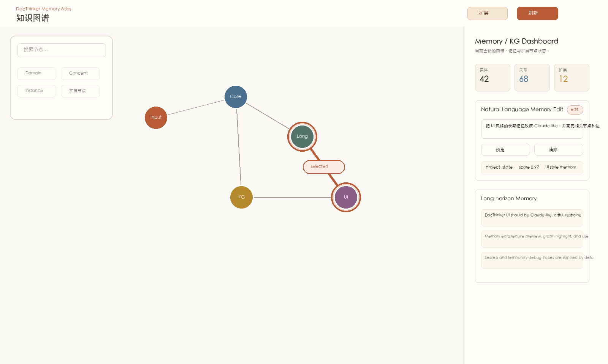
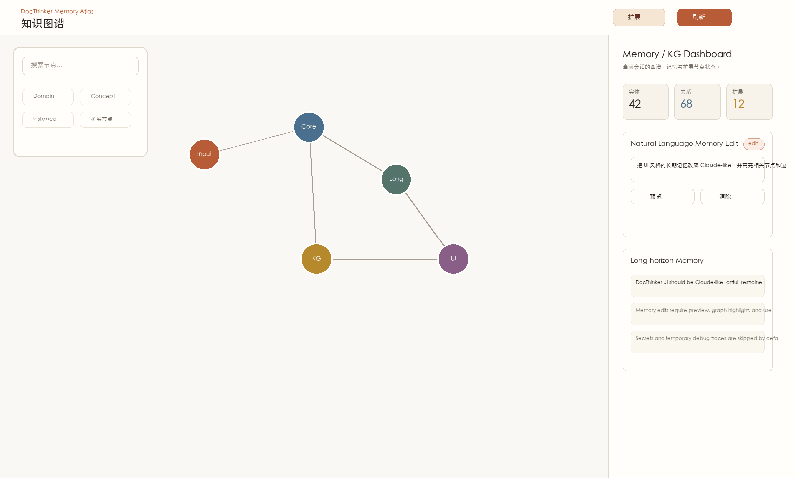

<div align="center">


# DocThinker

**Agentic Memory Framework · Self-Evolving Knowledge Graphs · Document Reasoning**

*Language captures the results of cognition, while cognition itself encompasses perception, experience, and reasoning.*

[](https://arxiv.org/pdf/2603.05551)
[](LICENSE)
[](http://localhost:5000)
[](#2--session-scoped-knowledge-graphs)
[](#4--tiered-conversation-memory-claw)

[](https://www.python.org/)
[](https://fastapi.tiangolo.com/)
[](https://flask.palletsprojects.com/)
[](https://networkx.org/)
[](https://github.com/facebookresearch/faiss)

[English](README.md) | [中文](README.zh-CN.md)

</div>

<br>

**DocThinker** is an agentic memory framework for text and multimodal carriers. It treats inputs as two primary forms: pure text, and image-text interactive documents. When visual evidence dominates, the carrier behaves like images; when language dominates, it behaves like text. DocThinker turns these inputs, chat turns, retrieval traces, and graph expansions into a multi-layer memory system that can recall, reason, and consolidate knowledge over time.

The name has two meanings: **Doc** as a multimodal carrier, and **Doc** as in doctor-level depth. DocThinker is built for carrier-grounded memory with research-grade reasoning.

Unlike a conventional retrieve-then-respond RAG pipeline, DocThinker treats knowledge as an evolving memory substrate: session-scoped knowledge graphs provide semantic memory, Claw provides tiered conversation memory, Neuro Memory provides episodic analogies, and KG expansion tracks hypotheses that can be promoted through use.

---

## 📑 Index

- [🚀 Quick Install](#-quick-install)
- [🔥 Quick Start](#-quick-start)
  - [1. Web UI & Server](#1-web-ui--server)
  - [2. Python API Usage](#2-python-api-usage)
  - [3. Memory Layer API](#3-memory-layer-api)
- [🧬 Key Contributions](#-key-contributions)
  - [1. Agentic Memory Core](#1--agentic-memory-core)
  - [2. Session-Scoped Knowledge Graphs](#2--session-scoped-knowledge-graphs)
  - [3. Self-Evolving KG Expansion](#3--self-evolving-kg-expansion)
  - [4. Tiered Conversation Memory (Claw)](#4--tiered-conversation-memory-claw)
  - [5. Episodic Analogy Memory](#5--episodic-analogy-memory)
  - [6. Multimodal Retrieval Signals](#6--multimodal-retrieval-signals)
  - [7. Memory & KG Observability](#7--memory--kg-observability)
- [💡 Use Cases](#-use-cases)
- [⚡ Query Modes & PDF Processing](#-query-modes)
- [📡 API Reference](#-api-reference)

---

## 🚀 Quick Install

We recommend using Python version 3.10 or higher for DocThinker.

```bash
# 1. Clone the repository
git clone https://github.com/Yang-Jiashu/doc-thinker.git
cd doc-thinker

# 2. Create a virtual environment
conda create -n docthinker python=3.11 -y
conda activate docthinker

# 3. Install dependencies
pip install -r requirements.txt
pip install -e .
```

---

## 🔥 Quick Start

### 1. Web UI & Server

The easiest way to experience DocThinker is through its web dashboard.

```bash
# 1. Configure environment variables (LLM API Keys)
cp env.example .env

# 2. Start the Backend API (FastAPI)
python -m uvicorn docthinker.server.app:app --host 0.0.0.0 --port 8000

# 3. Start the Frontend UI (Flask)
python run_ui.py
```
> Open `http://localhost:5000` — upload a PDF, ask questions, and explore the evolving knowledge graph.

### 2. Python API Usage

You can also use DocThinker programmatically with just a few lines of code.

```python
import asyncio
from docthinker import DocThinker, DocThinkerConfig

async def main():
    # 1. Configuration
    config = DocThinkerConfig(working_dir="./my_knowledge_base")
    
    # 2. Initialize (pass model functions, or provide a pre-initialized GraphCore)
    dt = DocThinker(
        config=config,
        llm_model_func=my_llm_func,
        embedding_func=my_embedding_func,
        vision_model_func=my_vision_func,
    )
    
    # 3. Ingest Document (Parsing & Knowledge Graph Construction)
    await dt.process_document_complete("your_document.pdf")
    
    # 4. Query the session knowledge graph
    response = await dt.aquery("What is the core idea of the document?", mode="mix")
    print(response)

asyncio.run(main())
```

### 3. Memory Layer API

The memory layer can be embedded without using the full web app. Third-party projects can implement the backend protocols and plug them into `AgentMemoryCore`. For framework and plugin authors, the same API is also exposed through the lightweight `docthinker-memory` package skeleton under `packages/docthinker-memory`.

```python
from docthinker.memory_core import AgentMemoryBackends, AgentMemoryCore, MemoryPolicy

memory = AgentMemoryCore(
    backends=AgentMemoryBackends(
        conversation=my_conversation_memory,
        episodic=my_episode_store,
        expanded=my_candidate_graph,
        long_horizon=my_long_horizon_store,
        graph=my_semantic_graph,
    ),
    policy=MemoryPolicy(
        episodic_top_k=3,
        expanded_top_k=2,
        long_horizon_top_k=3,
        enabled_layers=("conversation", "episodic", "expanded", "long_horizon", "graph"),
    ),
)

query = "What should the agent remember before answering?"

recall = await memory.recall(
    session_id="research-session",
    query=query,
    enable_thinking=True,
)

answer = await my_agent.run(query, context=recall.retrieval_instruction)

await memory.after_response(
    session_id="research-session",
    question=query,
    answer=answer,
    matched_expanded=recall.expanded_matches,
)
```

The package examples show how to build a memory plugin around an in-process store:

```bash
python packages/docthinker-memory/examples/custom_backend.py
```

See [`docs/MEMORY_PLUGIN_GUIDE.md`](docs/MEMORY_PLUGIN_GUIDE.md) for the backend contract checklist.

---

## 🧬 Key Contributions

DocThinker organizes retrieval and memory as an agent-facing framework instead of scattering memory logic across API handlers.

<div align="center">

<p><b>Figure 1.</b> DocThinker agentic memory architecture — session runtime, `AgentMemoryCore`, pluggable backend protocols, current adapters, retrieval/generation, and after-response consolidation.</p>
</div>

### 1. 🧠 Agentic Memory Core
`docthinker.memory_core.AgentMemoryCore` is the stable facade for agent memory work. It is not tied to Claw/OpenClaw: Claw is only the default conversation-memory adapter. External agents can plug in their own stores by implementing the backend protocols for conversation memory, episodic memory, long-horizon insight memory, expanded KG hypotheses, graph promotion, and optional chat-turn ingestion. `MemoryPolicy` controls which layers are active, how broad each recall step may be, and whether memory writes are allowed. Before generation, `recall()` builds a recall plan and merges:

* Claw working/core/archive conversation memory.
* Neuro Memory episodic analogy matches.
* Long-horizon cross-turn insights for project state, user preferences, and durable reasoning constraints.
* Memory-side reasoning derived from recalled insights before the final answer is generated.
* KG expanded-node matches and forced retrieval instructions.

After generation, `after_response()` consolidates the turn back into memory layers, writes chat episodes, stores durable long-horizon insights, optionally feeds the Q&A back into the graph, and promotes useful expanded nodes. Hosts can set `remember_turn=false` or pass `memory_excluded_layers` such as `["long_horizon", "episodic"]` to keep specific content out of memory. Long-horizon memory also has a management plane: it records write/skip decisions, blocks obvious secrets, avoids transient debug material by default, supports deletion, natural-language edit planning, confirmed updates, and `MEMORY.md`-style audit export.

### 2. 🧩 Session-Scoped Knowledge Graphs
Each session owns its own GraphCore-backed knowledge graph and document state. Uploaded files are parsed, inserted, and queried within that session, which keeps user context isolated while still allowing the graph to grow over time.

### 3. 🔀 Self-Evolving KG Expansion
Expansion operates in two complementary passes:
* **Path A (Cluster-based):** HDBSCAN clusters entity embeddings → LLM generates cluster summaries → expands new entities grounded in cluster themes.
* **Path B (Top-N multi-angle):** Top-50 highest-degree nodes expanded across 6 cognitive dimensions (hierarchy, causation, analogy, contrast, temporal, application).

Newly expanded nodes do not immediately become authoritative knowledge. They enter as candidates, are matched during query time, and only become formal graph nodes after repeated useful adoption in assistant responses.

### 4. 🗃️ Tiered Conversation Memory (Claw)
Claw implements a three-layer memory hierarchy for long-running conversations: hot working memory, warm core summaries, and cold semantic archives.

### 5. 🧠 Episodic Analogy Memory
Neuro Memory stores chat/document experiences as episodes and retrieves similar past situations as analogy context. These matches are surfaced through `episodic_matches` and injected as guidance rather than treated as direct factual sources.

### 6. ♾️ Long-Horizon Memory
The built-in `InMemoryLongHorizonBackend` gives the framework a default cross-turn loop: it classifies query intent, produces a recall plan, consolidates useful answers into durable insights, reasons over recalled memory, and returns `long_horizon_matches` plus `memory_reasoning` on later related questions. This backend is process-local by default so plugin authors can swap in SQLite, vector databases, or graph storage without changing agent code.

### 7. 🖼️ Multimodal Retrieval Signals
DocThinker tracks image assets extracted from documents and can activate relevant visual evidence during deep UI queries.

### 8. 📊 Memory & KG Observability
The web UI includes a query-time Memory Inspector and a KG dashboard. They expose recall plans, long-horizon matches, episodic matches, expanded-node lifecycle state, graph statistics, memory backend status, memory write decisions, delete/export controls, and evidence sources so users can inspect why an answer was generated and how knowledge is promoted over time. The KG dashboard also includes a natural-language memory editor: a user can type an edit instruction, preview matched long-horizon memories plus graph node/edge highlights, then apply or delete only the selected candidate. The current UI uses a warmer, Claude-inspired visual language while keeping the original dog mark.

<p align="center">
  
</p>
<p align="center"><b>Figure 2.</b> Natural-language memory editing preview with selected nodes and edges highlighted for safe manual operation.</p>

<p align="center">
  
</p>
<p align="center"><b>Demo.</b> Type an edit instruction, preview matched memory and graph highlights, then confirm the selected update.</p>

---

## 💡 Use Cases

<table>
<tr>
<td width="50%" valign="top">

> *"Upload a novel and explore its knowledge graph"*


</td>
<td width="50%" valign="top">

> *"Deep-mode conversation with episodic memory, expanded KG matching, and tiered memory"*


</td>
</tr>
</table>

---

## ⚡ Query Modes

| Mode | UI mapping | Strategy | Depth |
|------|------------|----------|-------|
| **Quick** | `naive` | Lightweight vector-style retrieval, rerank disabled | Shallow |
| **Standard** | `local` | Session KG retrieval with reranking | Medium |
| **Deep** | `mix` | KG + vector retrieval, Claw memory, episodic analogies, expanded-node matching, image activation, post-query consolidation | Full |

---

## 📄 PDF Processing

| Mode | Engine | Best for |
|------|--------|----------|
| `vlm` (repo config default) | Cloud VLM (Qwen-VL) | Image-heavy documents |
| `auto` | VLM (short) / MinerU (long) | General use |
| `mineru` | MinerU layout engine | Long documents with complex tables |

---

## 📡 API Reference

<details>
<summary><b>Click to expand API endpoints</b></summary>

| Category | Endpoint | Method | Description |
|----------|----------|--------|-------------|
| Sessions | `/api/v1/sessions` | GET / POST | List / create sessions |
| | `/api/v1/sessions/{id}/history` | GET | Chat history |
| | `/api/v1/sessions/{id}/files` | GET | Ingested files |
| Ingest | `/api/v1/ingest` | POST | Upload PDF / TXT |
| | `/api/v1/ingest/stream` | POST | Stream raw text |
| Query | `/api/v1/query/stream` | POST | SSE streaming query |
| | `/api/v1/query` | POST | Non-streaming query |
| | `/api/v1/query/text` | POST | Alias for non-streaming query |
| KG | `/api/v1/knowledge-graph/data` | GET | Nodes + edges for visualization |
| | `/api/v1/knowledge-graph/expand` | POST | Trigger KG expansion |
| | `/api/v1/knowledge-graph/stats` | GET | KG statistics |
| | `/api/v1/knowledge-graph/expanded-nodes` | GET | Expanded-node lifecycle state |
| Memory | `/api/v1/memory/stats` | GET | Episode + Claw memory stats |
| | `/api/v1/memory/dashboard` | GET | Aggregated KG + memory dashboard state |
| | `/api/v1/memory/long-horizon` | GET | List editable long-horizon memory records |
| | `/api/v1/memory/long-horizon/edit-plan` | POST | Map a natural-language edit instruction to candidate memories |
| | `/api/v1/memory/long-horizon/{memory_id}` | PATCH | Update one long-horizon memory record after user confirmation |
| | `/api/v1/memory/long-horizon/{memory_id}` | DELETE | Delete one long-horizon memory record |
| | `/api/v1/memory/long-horizon/export` | GET | Export a `MEMORY.md`-style audit index |
| Settings | `/api/v1/settings` | GET / POST | Runtime config |

</details>

---

## 📝 Citation

If you find DocThinker useful in your research, please cite:

```bibtex
@article{yang2026autothinkrag,
  title={AutothinkRAG: Complexity-Aware Control of Retrieval-Augmented Reasoning for Image-Text Interaction},
  author={Yang, Jiashu and Zhang, Chi and Wuerkaixi, Abudukelimu and Cheng, Xuxin and Liu, Cao and Zeng, Ke and Jia, Xu and Cai, Xunliang},
  journal={arXiv preprint arXiv:2603.05551},
  year={2026}
}
```

## 🤝 Contributing

PRs and issues welcome! See [CONTRIBUTING.md](CONTRIBUTING.md).

## 📜 License

[MIT](LICENSE)
