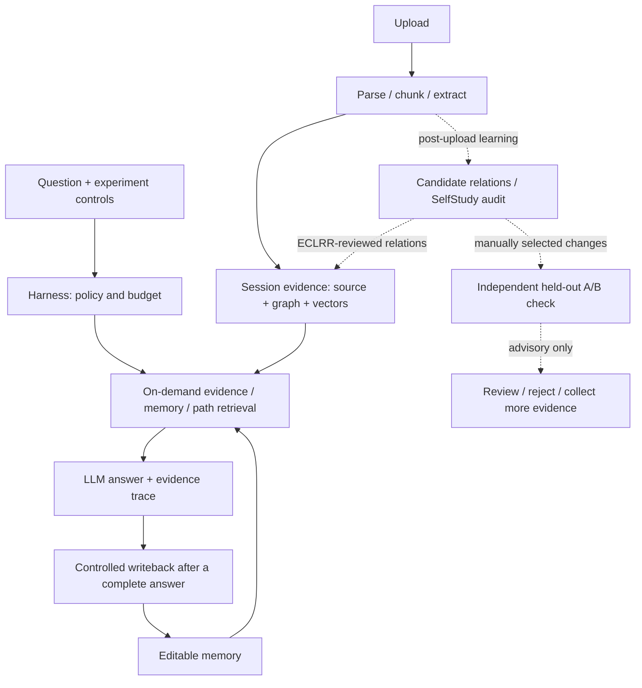

<div align="center">


# DocThinker

**An agent should remember, retrieve, and show what its answer rests on.**

Document QA · Editable long-term memory · Evidence-bounded knowledge evolution

[English](README.md) · [中文](README.zh-CN.md) · [Quick start](#quick-start) · [Architecture](docs/ARCHITECTURE.md) · [Evaluation](docs/SELF_EVOLUTION_EVALUATION.md)

[](pyproject.toml)
[](https://github.com/Yang-Jiashu/Doc-thinker/actions/workflows/ci.yml)
[](https://arxiv.org/abs/2603.05551)
[](LICENSE)

</div>

## What it does

DocThinker is an observable memory and retrieval runtime for document research and long-running agents. **Documents supply evidence; memories supply context; generated associations remain candidates.** These are different kinds of information.

| Your task | Runtime behavior |
|---|---|
| Answer from a document | Retrieve source evidence; disclose gaps instead of substituting inferred relations |
| Understand a multi-step relationship | Search a bounded directed neighborhood for continuous paths and sources; connectivity is not proof of causality |
| Explore related ideas | Rank and diversify graph associations while keeping hypotheses separate from facts |
| Remember preferences and rules | Inspect, edit, delete, and restore long-term memory independently of ordinary chat history |
| Run controlled comparisons | Toggle memory, history, LLM cache, and evolution separately; inspect policy and budget traces |

> This is a research/development framework, not a demonstrated recursive self-improvement (RSI) system. Post-upload learning is wired; episodic overnight consolidation remains a separate experimental workflow. Independent evaluation must establish whether knowledge growth improves capability.

## Architecture at a glance


```mermaid
flowchart TD
    U["Upload"] --> I["Parse / chunk / extract"]
    I --> S["Session evidence: source + graph + vectors"]
    Q["Question + experiment controls"] --> H["Harness: policy and budget"]
    H --> R["On-demand evidence / memory / path retrieval"]
    S --> R
    M["Editable memory"] --> R
    R --> A["LLM answer + evidence trace"]
    A --> W["Controlled writeback after a complete answer"]
    W --> M
    I -.post-upload learning.-> C["Candidate relations / SelfStudy audit"]
    C -.ECLRR-reviewed relations.-> S
    C -.manually selected changes.-> E["Independent held-out A/B check"]
    E -.advisory only.-> V["Review / reject / collect more evidence"]
```

Code supplies the skeleton: isolation, selection, paths, budgets, and admission checks. Models supply semantic extraction, answer generation, and optional proposals. Not every step needs an LLM call.

## Quick start

Python 3.11 is recommended. Install from a repository checkout in editable mode. Parsing dependencies are substantial; initial installation and model downloads can take a while.

```bash
git clone https://github.com/Yang-Jiashu/Doc-thinker.git
cd Doc-thinker
python3.11 -m venv .venv
source .venv/bin/activate
python -m pip install -e ".[all]"
cp -n env.example .env
```

Edit `.env` with services you can access. Never commit API keys.

| Settings | Check |
|---|---|
| `LLM_BINDING_HOST`, `LLM_BINDING_API_KEY`, `LLM_MODEL` | Answer model and compatible endpoint |
| `KEYWORD_LLM_MODEL`, `ENTITY_EXTRACTION_LLM_MODEL` | Models available at that endpoint; may match the answer model |
| `EMBEDDING_BINDING_HOST`, `EMBEDDING_BINDING_API_KEY`, `EMBEDDING_MODEL`, `EMBEDDING_DIM` | Configured dimensions must match embedding output |
| `VLM_MODEL` | An available vision model when using multimodal processing |
| `RAG_WORKDIR` | Defaults to `./rag_storage_api`, including the long-horizon SQLite database |

Use two terminals, initially listening only on localhost:

```bash
# Terminal 1: backend
python -m uvicorn docthinker.server.app:app --host 127.0.0.1 --port 8000

# Terminal 2: UI (port 5000 may be occupied by macOS)
UI_HOST=127.0.0.1 UI_PORT=5001 python run_ui.py
```

Open [Chat](http://127.0.0.1:5001/query), [Knowledge & memory](http://127.0.0.1:5001/knowledge-graph), or [API docs](http://127.0.0.1:8000/docs). The UI proxy expects local port 8000. Configure authentication, reverse proxying, and access controls separately before remote deployment.

**First run:** create a session → upload one TXT → wait for ingestion → ask in faithful mode → inspect the memory/evidence trace. Start with text before PDF/image processing. Startup probes, extraction, and background learning may call models; query controls do not globally disable model use.

## Interface and experiments

Answer intent is visible on the main screen: automatic, faithful, path, or exploratory. Retrieval depth and experiment controls are progressively disclosed; retrieving more should not be mistaken for greater reliability.

- Memory, history, cache, and evolution controls are independent. Disabling history does not disable long-term memory.
- Compact context is enabled by default. Extra LLM path completion and reviewed inferred-relation retrieval are opt-in.
- The memory trace exposes the current policy, budget, and evidence, including on mobile.
- Faithful mode excludes expanded hypotheses; ordinary conversation may still use enabled history and memory.

See the [query runtime guide](docs/QUERY_RUNTIME.md) for parameters and a copyable baseline request.

## How far does self-improvement go?

| Status | Capability |
|---|---|
| Wired | Session isolation, layered memory, evidence retrieval, budgets, controlled writeback, and Memory Trace |
| Wired; efficacy needs evaluation | Post-upload ECLRR review; SelfStudy outputs are audit-only and do not overwrite source node descriptions |
| Offline tool | Per-question-family candidate checks covering quality and cost; advisory only, no automatic deployment |
| Experimental | Episodic linking, reinforcement, decay, and pruning; separate SEAL / TriGraph paths |
| Not yet a complete loop | Independently validated policy adoption, whole-system rollback, and demonstrated RSI |

The objective is **better use of evidence, not simply a larger graph**. This architecture can support bounded self-improvement experiments but is not complete RSI. See [architecture assessment](docs/ARCHITECTURE.md) for gaps and priorities.

## Development and validation

```bash
python -m pip install -e ".[all,test]"
python -m pytest tests/ -q --ignore=tests/debug_db.py

# No LLM call. Input format and independent review requirements are in the guide.
python -m docthinker.evaluation --baseline baseline.json --candidate candidate.json
```

Unit tests use model doubles and synthetic evidence; they do not establish real answer quality or provider-token savings. Lexical scores are screening proxies, not tests of negation, causality, or factual support.

## Documentation

| Guide | Contents |
|---|---|
| [Architecture and RSI boundaries](docs/ARCHITECTURE.md) | Online/background responsibilities, efficiency, remaining gaps |
| [Query runtime](docs/QUERY_RUNTIME.md) | Modes, controls, budgets, A/B requests |
| [Self-evolution evaluation](docs/SELF_EVOLUTION_EVALUATION.md) | Held-out data, review rubric, admission input format |
| [Memory plugin guide](docs/MEMORY_PLUGIN_GUIDE.md) | Embed `AgentMemoryCore` in another agent |
| [Contributing](CONTRIBUTING.md) | Development workflow |

Main entry points: `docthinker/harness.py` for policy; `docthinker/memory_core/` for memory; `graphcore/` for evidence; `docthinker/server/routers/ingest.py` for post-upload learning; `docthinker/ui/` for interaction.

## Citation and license

```bibtex
@article{yang2026autothinkrag,
  title={AutothinkRAG: Complexity-Aware Control of Retrieval-Augmented Reasoning for Image-Text Interaction},
  author={Yang, Jiashu and Zhang, Chi and Wuerkaixi, Abudukelimu and Cheng, Xuxin and Liu, Cao and Zeng, Ke and Jia, Xu and Cai, Xunliang},
  journal={arXiv preprint arXiv:2603.05551},
  year={2026}
}
```

Current releases use the [PolyForm Shield License 1.0.0](LICENSE). Previously MIT-licensed releases retain their original license.
