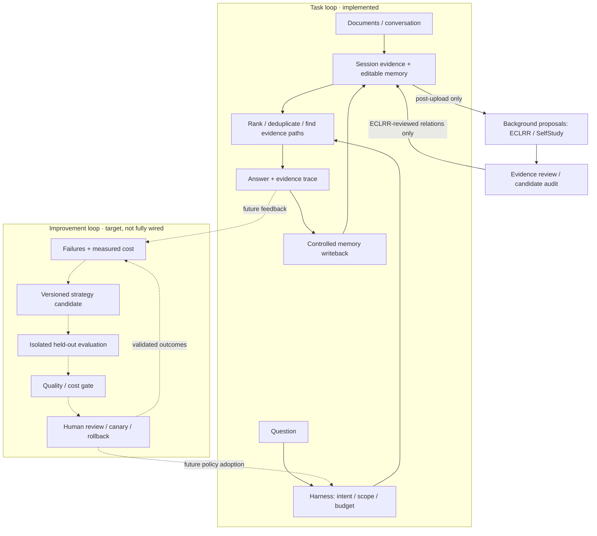

<div align="center">

# DocThinker

**From evidence and memory to verifiable self-improvement.**

A research path toward recursive self-improvement (RSI)

[English](README.md) · [中文](README.zh-CN.md) · [Quick start](#quick-start) · [Architecture](docs/ARCHITECTURE.md) · [RSI roadmap](docs/RSI_ROADMAP.md)

[](pyproject.toml)
[](https://github.com/Yang-Jiashu/Doc-thinker/actions/workflows/ci.yml)
[](https://arxiv.org/abs/2603.05551)
[](LICENSE)

</div>

## Why this project exists

**DocThinker's destination is RSI, not just a bigger knowledge graph or another document chatbot.** The research question is how an agent can learn from tasks, propose changes to how it works, verify that those changes help, and use the validated results to improve its next round of improvement.

The starting point is a document-grounded agent: inspectable evidence, editable memory, bounded retrieval, and background knowledge organization. These provide a testable environment for improvement; knowledge growth alone does not demonstrate increased capability.

**Working today:** document QA, layered memory, controlled reasoning paths, candidate generation, and an offline quality/cost gate. **Next milestone:** versioned candidates → isolated evaluation → reviewed adoption → rollback. This deployment loop is not yet wired end to end. See the [RSI milestones and acceptance criteria](docs/RSI_ROADMAP.md).

## Use it today

| Your task | Runtime behavior |
|---|---|
| Answer from a document | Retrieve source evidence; disclose gaps instead of substituting inferred relations |
| Understand a multi-step relationship | Search a bounded directed neighborhood for continuous paths and sources; connectivity is not proof of causality |
| Explore related ideas | Rank and diversify graph associations while keeping hypotheses separate from facts |
| Remember preferences and rules | Inspect, edit, delete, and restore long-term memory independently of ordinary chat history |
| Run controlled comparisons | Toggle memory, history, LLM cache, and evolution separately; inspect policy and budget traces |

Documents supply evidence; memories supply context; generated associations remain candidates. Post-upload learning is wired. Episodic overnight consolidation is a separate experimental workflow, not the same thing as the upload trigger.

## Two loops, one direction


```mermaid
flowchart TD
    subgraph Runtime["Task loop · implemented"]
        U["Documents / conversation"] --> S["Session evidence + editable memory"]
        Q["Question"] --> H["Harness: intent / scope / budget"]
        H --> R["Rank / deduplicate / find evidence paths"]
        S --> R
        R --> A["Answer + evidence trace"]
        A --> W["Controlled memory writeback"]
        W --> S
    end
    S -->|post-upload only| C["Background proposals: ECLRR / SelfStudy"]
    C --> D["Evidence review / candidate audit"]
    D -->|ECLRR-reviewed relations only| S
    subgraph Improvement["Improvement loop · target, not fully wired"]
        F["Failures + measured cost"] -.-> V["Versioned strategy candidate"]
        V -.-> E["Isolated held-out evaluation"]
        E -.-> G["Quality / cost gate"]
        G -.-> P["Human review / canary / rollback"]
        P -.validated outcomes.-> F
    end
    A -.future feedback.-> F
    P -.future policy adoption.-> H
```

Solid arrows show implemented connections; dashed arrows show the planned improvement loop. Its gate already exists as an [offline tool](docs/SELF_EVOLUTION_EVALUATION.md), but it does not execute experiments or deploy changes.

Code supplies the skeleton: isolation, selection, paths, budgets, scheduling, and admission checks. Models supply semantic extraction, answer generation, and optional proposals. **The first improvement target is the harness and retrieval strategy, not model weights.**

## Quick start

Python 3.11 is recommended. Install from a repository checkout in editable mode. Parsing dependencies are substantial; initial installation and model downloads can take a while.

```bash
git clone https://github.com/Yang-Jiashu/Doc-thinker.git
cd Doc-thinker
python3.11 -m venv .venv
source .venv/bin/activate
python -m pip install -e ".[all]"
cp -n env.example .env
```

Edit `.env` with services you can access. Never commit API keys.

| Settings | Check |
|---|---|
| `LLM_BINDING_HOST`, `LLM_BINDING_API_KEY`, `LLM_MODEL` | Answer model and compatible endpoint |
| `KEYWORD_LLM_MODEL`, `ENTITY_EXTRACTION_LLM_MODEL` | Models available at that endpoint; may match the answer model |
| `EMBEDDING_BINDING_HOST`, `EMBEDDING_BINDING_API_KEY`, `EMBEDDING_MODEL`, `EMBEDDING_DIM` | Configured dimensions must match embedding output |
| `VLM_MODEL` | An available vision model when using multimodal processing |
| `RAG_WORKDIR` | Defaults to `./rag_storage_api`, including the long-horizon SQLite database |

Use two terminals, initially listening only on localhost:

```bash
# Terminal 1: backend
python -m uvicorn docthinker.server.app:app --host 127.0.0.1 --port 8000

# Terminal 2: UI (port 5000 may be occupied by macOS)
UI_HOST=127.0.0.1 UI_PORT=5001 python run_ui.py
```

Open [Chat](http://127.0.0.1:5001/query), [Knowledge & memory](http://127.0.0.1:5001/knowledge-graph), or [API docs](http://127.0.0.1:8000/docs). The UI proxy expects local port 8000. Configure authentication, reverse proxying, and access controls separately before remote deployment.

**First run:** create a session → upload one TXT → wait for ingestion → ask in faithful mode → inspect the memory/evidence trace. Start with text before PDF/image processing. Startup probes, extraction, and background learning may call models; query controls do not globally disable model use.

## Interface and experiments

The workspace uses a neutral, Codex-inspired layout: a session sidebar, a focused conversation area, a compact composer, and an on-demand evidence panel. It uses DocThinker's own branding and is not affiliated with OpenAI.

Answer intent is visible on the main screen: automatic, faithful, path, or exploratory. Retrieval depth and experiment controls are progressively disclosed; retrieving more should not be mistaken for greater reliability.

- Memory, history, cache, and evolution controls are independent. Disabling history does not disable long-term memory.
- Compact context is enabled by default. Extra LLM path completion and reviewed inferred-relation retrieval are opt-in.
- The memory trace exposes the current policy, budget, and evidence, including on mobile.
- Faithful mode excludes expanded hypotheses; ordinary conversation may still use enabled history and memory.

See the [query runtime guide](docs/QUERY_RUNTIME.md) for parameters and a copyable baseline request.

## How far does self-improvement go?

| Status | Capability |
|---|---|
| Wired | Session isolation, layered memory, evidence retrieval, budgets, controlled writeback, and Memory Trace |
| Wired; efficacy needs evaluation | Post-upload ECLRR review; SelfStudy graph-change candidates are audit-only and do not overwrite source descriptions; experiences are stored separately |
| Offline tool | Per-question-family candidate checks covering quality and cost; advisory only, no automatic deployment |
| Experimental | Episodic linking, reinforcement, decay, and pruning; separate SEAL / TriGraph paths |
| Not yet a complete loop | Independently validated policy adoption, whole-system rollback, and demonstrated RSI |

The objective is **measurable task improvement under quality and cost constraints**. Keep useful exploration, but do not let it contaminate faithful answers. The next stage must change and evaluate a strategy, not merely append more relations. See the [architecture assessment](docs/ARCHITECTURE.md) and [RSI roadmap](docs/RSI_ROADMAP.md).

## Efficiency: what is improved, what remains

- Online work is bounded: request budgets, local graph traversal, batch reads, cached per-request edge scores, and diversified evidence selection.
- Background work is controlled: per-session upload learning is coalesced and serialized, with bounded cross-session concurrency; SelfStudy has call/time limits and estimated token admission checks.
- Algorithmic work stays algorithmic: scope checks, routing heuristics, PPR, MMR, and path search do not require a generation call.
- Remaining work includes provider-wide usage accounting, durable jobs, incremental graph updates, large-dataset profiling, and a complete version/evaluate/adopt/rollback loop.

This is not a claim that every performance bottleneck is solved. Operation-count tests are not end-to-end speed or billed-token benchmarks. Read the [cost boundaries](docs/ARCHITECTURE.md#效率边界与验证方法) before using the system for large experiments.

## Development and validation

```bash
python -m pip install -e ".[all,test]"
python -m pytest tests/ -q --ignore=tests/debug_db.py

# No LLM call. Input format and independent review requirements are in the guide.
python -m docthinker.evaluation --baseline baseline.json --candidate candidate.json
```

For a UI-only preview, run `PYTHONPATH=. python tests/ui_preview.py` and open the [local preview](http://127.0.0.1:5055/query). It serves mock data without model calls or real document storage; it is not an answer-quality benchmark.

Unit tests use model doubles and synthetic evidence; they do not establish real answer quality or provider-token savings. Lexical scores are screening proxies, not tests of negation, causality, or factual support.

## Documentation

| Guide | Contents |
|---|---|
| [Architecture and efficiency](docs/ARCHITECTURE.md) | Online/background responsibilities, cost boundaries, remaining gaps |
| [RSI roadmap](docs/RSI_ROADMAP.md) | Improvement targets, algorithmic loop, milestones, acceptance criteria |
| [Query runtime](docs/QUERY_RUNTIME.md) | Modes, controls, budgets, A/B requests |
| [Self-evolution evaluation](docs/SELF_EVOLUTION_EVALUATION.md) | Held-out data, review rubric, admission input format |
| [Memory plugin guide](docs/MEMORY_PLUGIN_GUIDE.md) | Embed `AgentMemoryCore` in another agent |
| [Contributing](CONTRIBUTING.md) | Development workflow |

Main entry points: `docthinker/harness.py` for policy; `docthinker/memory_core/` for memory; `graphcore/` for evidence; `docthinker/server/routers/ingest.py` for post-upload learning; `docthinker/ui/` for interaction.

## Citation and license

```bibtex
@article{yang2026autothinkrag,
  title={AutothinkRAG: Complexity-Aware Control of Retrieval-Augmented Reasoning for Image-Text Interaction},
  author={Yang, Jiashu and Zhang, Chi and Wuerkaixi, Abudukelimu and Cheng, Xuxin and Liu, Cao and Zeng, Ke and Jia, Xu and Cai, Xunliang},
  journal={arXiv preprint arXiv:2603.05551},
  year={2026}
}
```

Current releases use the [PolyForm Shield License 1.0.0](LICENSE). Previously MIT-licensed releases retain their original license.
