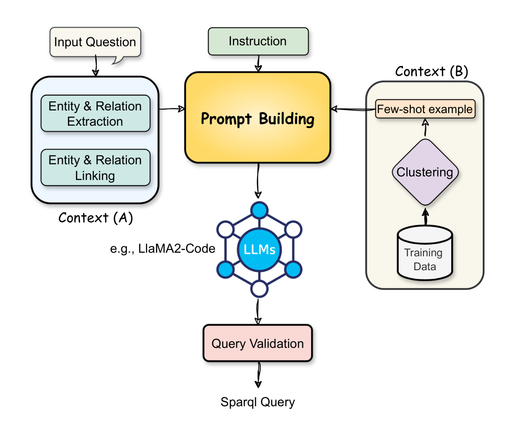
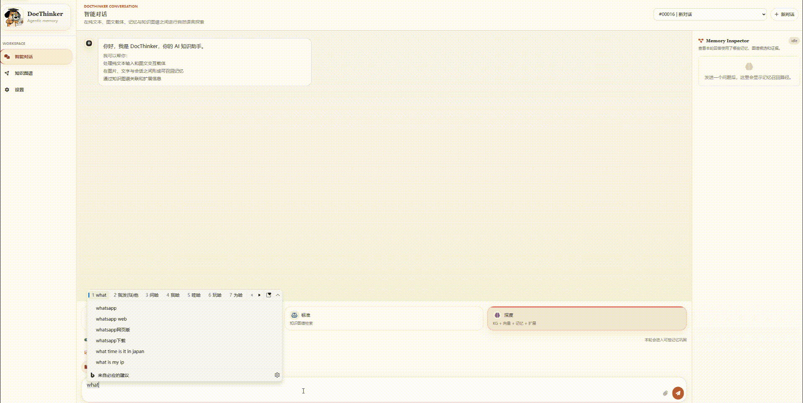

<div align="center">


# DocThinker

**自进化知识图谱 · 长短期记忆 · 结构化推理**

*语言记录了认知过程的结果，而认知过程包含感知，经验，推理的过程。*

[](https://arxiv.org/pdf/2603.05551)
[](LICENSE)
[](http://localhost:5000)
[](https://github.com/HKUDS/LightRAG)
[](https://github.com/letta-ai/letta)

[](https://www.python.org/)
[](https://fastapi.tiangolo.com/)
[](https://flask.palletsprojects.com/)
[](https://networkx.org/)
[](https://github.com/facebookresearch/faiss)

[English](README.md) | [中文](README.zh-CN.md)

</div>

<br>

**DocThinker** 是一个文档驱动的 RAG 系统，从上传文档中构建自进化的知识图谱。与传统"检索-LLM 回复"路线不同，DocThinker 将知识视为**动态的图谱**。

### 🎬 探索教程!!

<!-- TODO: 替换为演示视频 -->
> [▶️ **在 YouTube 观看教程**](#) | [🚀 **在 HuggingFace Space 体验**](#) | [📝 **Colab 教程**](#)

---

## 📑 目录 (Index)

- [🚀 快速安装 (Quick Install)](#-快速安装)
- [🔥 快速开始 (Quick Start)](#-快速开始)
  - [1. Web UI & 服务端](#1-web-ui--服务端)
  - [2. Python API 极简调用](#2-python-api-极简调用)
- [🧬 核心贡献 (Key Contributions)](#-核心贡献)
  - [1. Test-Time Scaling 与智能体记忆](#1--test-time-scaling-与智能体记忆)
  - [2. 双路径图谱自扩张](#2--双路径-kg-自扩展)
  - [3. 自进化知识图谱](#3--自进化知识图谱)
  - [4. 多 Agent 协同进化](#4--多-agent-协同进化)
  - [5. 分层对话记忆 (Claw)](#5--分层对话记忆claw)
  - [6. SPARQL 链式思维推理](#6--sparql-链式思维推理)
- [💡 使用场景 (Use Cases)](#-使用场景)
- [⚡ 查询模式与文档处理](#-查询模式)
- [📡 API 参考](#-api-参考)
- [❓ 常见问题 (FaQ)](#-faq)

---

## 🚀 快速安装

推荐使用 Python 3.10 或更高版本。

```bash
# 1. 克隆代码仓库
git clone https://github.com/Yang-Jiashu/doc-thinker.git
cd doc-thinker

# 2. 创建虚拟环境
conda create -n docthinker python=3.11 -y
conda activate docthinker

# 3. 安装依赖
pip install -r requirements.txt
pip install -e .
```

---

## 🔥 快速开始

### 1. Web UI & 服务端

最直观的体验方式是使用 Web 控制台：

```bash
# 1. 配置文件（填入大模型 API Keys）
cp env.example .env

# 2. 启动后端 API（FastAPI）
python -m uvicorn docthinker.server.app:app --host 0.0.0.0 --port 8000

# 3. 启动前端 UI（Flask）
python run_ui.py
```
> 打开 `http://localhost:5000` — 上传 PDF，提出问题，探索不断生长的知识图谱。

### 2. Python API 极简调用

你也可以用极简的 Python API 快速集成 DocThinker：

```python
import asyncio
from docthinker import DocThinker, DocThinkerConfig

async def main():
    # 1. 初始化配置
    config = DocThinkerConfig(working_dir="./my_knowledge_base")
    
    # 2. 实例化 (需要预先配置 LLM 和 Embedding 模型)
    dt = DocThinker(config=config, ...) 
    
    # 3. 摄入文档 (解析 + 构建知识图谱)
    await dt.process_document_complete("your_document.pdf")
    
    # 4. 触发 Test-Time Scaling (KG 后台自习循环)，增强图谱密度与经验记忆
    await dt.run_self_study_loop(max_rounds=5)
    
    # 5. 深度图谱推理查询
    response = await dt.aquery("这篇文档的核心思想是什么？", mode="deep")
    print(response)

asyncio.run(main())
```

---

## 🧬 核心贡献

DocThinker 将庞大的管线拆分为自主的智能体，并引入了图谱认知推理。

<div align="center">

<p><b>图 1.</b> DocThinker 端到端管线 — 从文档输入到知识图谱构建、分层记忆管理、混合检索推理，最终输出并反馈回图谱。</p>
</div>

### 1. 🧠 Test-Time Scaling 与智能体记忆
在文档写入和用户查询之间，系统会插入**后台自习循环 (Test-Time Scaling on KG)**：LLM 会对已有 KG 自主进行“出题 → 检索答题 → 归纳演绎”，并将产生的新知识和方法论经验（`entity_type="experience"`）作为智能体记忆写回图谱中。这通过不断的演绎推理，在不增加用户等待时间的情况下，大幅提升了知识图谱的信息密度和系统的推理能力。

### 2. 🔀 双路径 KG 自扩展
扩展以两条互补路径执行：
* **A — 聚类驱动：** HDBSCAN 聚类实体 embedding → LLM 生成聚类摘要 → 基于摘要主题扩展新实体。
* **B — Top-N 多角度：** 取连接度最高的 50 个节点，从 6 个认知维度（层级、因果、类比、对立、时序、应用）扩展。

### 3. 🔄 自进化知识图谱
扩展的新节点不会直接成为正式知识——它们先以 `candidate` 身份进入图谱。只有当用户在实际对话中反复用到某个节点时，该节点的使用计数和评分才会累积，满足条件后晋升为正式节点。

### 4. 🤖 多 Agent 协同进化
DocThinker 将传统 RAG 的单一管线拆分为三个专职 Agent：
* **Retrieval Agent:** 负责最大化检索命中率。
* **Extraction Agent:** 负责最大化信息抽取覆盖率。
* **Answering Agent:** 负责生成最终回答并触发节点反馈。

<div align="center">

<p><sub><b>图 2.</b> DocThinker 多 Agent 协同进化架构。</sub></p>
</div>

### 5. 🗃️ 分层对话记忆 (Claw)
受 [OpenClaw / Letta](https://github.com/letta-ai/letta) 启发，Claw 实现了**三层记忆层级**（热、温、冷），实现无界对话长度。

### 6. 🧠 SPARQL 链式思维推理
复杂查询在回答前被内部分解为 **SPARQL 风格的三元组模式链**。LLM 通过共享变量链在 KG 上下文中绑定变量。

<div align="center">

</div>

---

## 💡 使用场景

<table>
<tr>
<td width="50%" valign="top">

> *"上传小说，探索自动构建的知识图谱"*


</td>
<td width="50%" valign="top">

> *"深度模式对话 — SPARQL CoT 推理 + 分层记忆"*



</td>
</tr>
</table>

---

## ⚡ 查询模式

| 模式 | 策略 | 延迟 | 深度 |
|------|------|------|------|
| **快速** | 向量相似度 | ~1 s | 浅 |
| **标准** | 混合 KG + 向量 + 重排序 | ~3 s | 中 |
| **深度** | SPARQL CoT + 扩散激活 + 情节记忆 + 扩展匹配 + 查询后反馈 | ~8 s | 完整 |

<details>
<summary><b>深度模式管线（7 步）</b></summary>

1. 通过扩散激活从情节记忆中检索类比情节。
2. 将扩展候选节点与查询匹配（词重叠 + 嵌入相似度）。
3. 将命中的扩展节点作为强制检索指令注入。
4. 将查询分解为 SPARQL CoT 三元组模式链。
5. 混合 KG + 向量检索并启用扩散激活。
6. LLM 使用完整上下文和变量绑定生成回答。
7. 查询后反馈：验证扩展节点、存储情节、共激活链接、更新 Claw 记忆层。

</details>

## 📄 PDF 处理

| 模式 | 引擎 | 适用场景 |
|------|------|---------|
| `auto`（默认） | VLM（短文档）/ MinerU（长文档） | 通用 |
| `vlm` | 云端 VLM（Qwen-VL） | 图片密集文档 |
| `mineru` | MinerU 布局引擎 | 含复杂表格的长文档 |

<details>
<summary><b>📡 API 参考</b></summary>

| 类别 | 端点 | 方法 | 说明 |
|------|------|------|------|
| 会话 | `/sessions` | GET / POST | 列出 / 创建会话 |
| | `/sessions/{id}/history` | GET | 聊天历史 |
| | `/sessions/{id}/files` | GET | 已上传文件 |
| 上传 | `/ingest` | POST | 上传 PDF / TXT |
| | `/ingest/stream` | POST | 流式文本上传 |
| 查询 | `/query/stream` | POST | SSE 流式查询 |
| | `/query` | POST | 非流式查询 |
| KG | `/knowledge-graph/data` | GET | 可视化节点/边 |
| | `/knowledge-graph/expand` | POST | 触发双路径扩展 |
| | `/knowledge-graph/stats` | GET | KG 统计 |
| 记忆 | `/memory/stats` | GET | 情节 + Claw 记忆统计 |
| | `/memory/consolidate` | POST | 触发情节固化 |
| 设置 | `/settings` | GET / POST | 运行时配置 |

</details>

<details>
<summary><b>📂 项目结构</b></summary>

| 目录 | 说明 |
|------|------|
| `docthinker/` | 核心：PDF 解析、KG 构建、查询路由、双路径扩展（`kg_expansion/`）、自动思考（`auto_thinking/`）、HyperGraphRAG（`hypergraph/`）、服务端（`server/`）、UI（`ui/`）。 |
| `graphcore/` | 图 RAG 引擎：KG 存储（NetworkX / FAISS / Qdrant / PG）、SPARQL CoT 提示词、实体抽取、重排序。 |
| `neuro_memory/` | 情节记忆：扩散激活、情节存储、类比检索、记忆固化。 |
| `claw/` | 分层记忆：热层（工作记忆）、温层（核心 / MEMORY.md）、冷层（语义档案）。 |
| `config/` | `settings.yaml` — PDF、记忆、检索、认知参数。 |

</details>

---

## 📝 引用

如果 DocThinker 对您的研究有帮助，请引用：

```bibtex
@article{yang2026autothinkrag,
  title={AutothinkRAG: Complexity-Aware Control of Retrieval-Augmented Reasoning for Image-Text Interaction},
  author={Yang, Jiashu and Zhang, Chi and Wuerkaixi, Abudukelimu and Cheng, Xuxin and Liu, Cao and Zeng, Ke and Jia, Xu and Cai, Xunliang},
  journal={arXiv preprint arXiv:2603.05551},
  year={2026}
}
```

## 🤝 贡献

欢迎 PR 和 Issue！详见 [CONTRIBUTING.md](CONTRIBUTING.md)。

## 📜 协议

[MIT](LICENSE)
