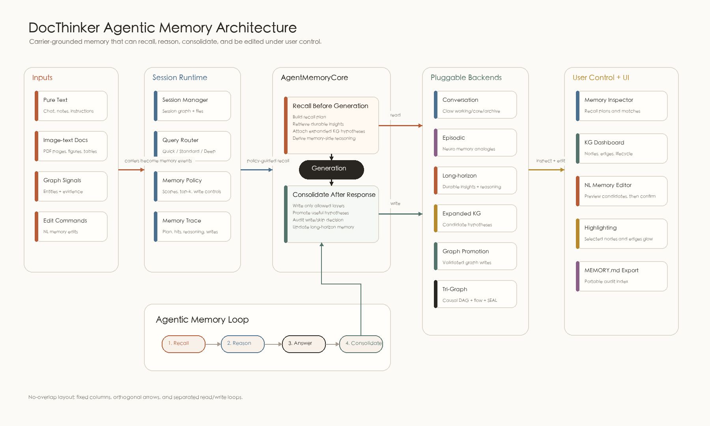

<div align="center">


# DocThinker

**Agentic Memory Framework · 自进化知识图谱 · 文档推理**

*语言记录了认知过程的结果，而认知过程包含感知，经验，推理的过程。*

[](https://arxiv.org/pdf/2603.05551)
[](LICENSE)
[](http://localhost:5000)
[](#2--会话级知识图谱)
[](#4--分层对话记忆-claw)

[](https://www.python.org/)
[](https://fastapi.tiangolo.com/)
[](https://flask.palletsprojects.com/)
[](https://networkx.org/)
[](https://github.com/facebookresearch/faiss)

[English](README.md) | [中文](README.zh-CN.md)

</div>

<br>

**DocThinker** 是一个面向纯文本与多模态载体的 agentic memory 框架。输入被定义为两类：纯文本，以及图文交互的文档载体。图像证据占主导时，它更像图片；文本证据占主导时，它更像文字。DocThinker 会把这些输入、对话轮次、检索轨迹和图谱扩展转化为可召回、可推理、可巩固的多层记忆系统。

这个名字有两层含义：**Doc** 既是多模态载体，也暗含 doctor / 博士级深度。DocThinker 的目标是让 agent 基于载体形成记忆，并具备研究级的推理能力。

与传统“检索后回答”的 RAG 管线不同，DocThinker 将知识视为持续演化的记忆底座：session-scoped 知识图谱承担语义记忆，Claw 承担分层对话记忆，Neuro Memory 承担情节类比记忆，KG expansion 则维护可被使用和晋升的图谱假设。

---

## 📑 目录 (Index)

- [🚀 快速安装 (Quick Install)](#-快速安装)
- [🔥 快速开始 (Quick Start)](#-快速开始)
  - [1. Web UI & 服务端](#1-web-ui--服务端)
  - [2. Python API 极简调用](#2-python-api-极简调用)
  - [3. Memory Layer API](#3-memory-layer-api)
- [🧬 核心贡献 (Key Contributions)](#-核心贡献)
  - [1. Agentic Memory Core](#1--agentic-memory-core)
  - [2. 会话级知识图谱](#2--会话级知识图谱)
  - [3. 自进化 KG 扩展](#3--自进化-kg-扩展)
  - [4. 分层对话记忆 (Claw)](#4--分层对话记忆-claw)
  - [5. 情节类比记忆](#5--情节类比记忆)
  - [6. 多模态检索信号](#6--多模态检索信号)
  - [7. 记忆与图谱可观测性](#7--记忆与图谱可观测性)
- [💡 使用场景 (Use Cases)](#-使用场景)
- [⚡ 查询模式与文档处理](#-查询模式)
- [📡 API 参考](#-api-参考)

---

## 🚀 快速安装

推荐使用 Python 3.10 或更高版本。

```bash
# 1. 克隆代码仓库
git clone https://github.com/Yang-Jiashu/Doc-thinker.git
cd doc-thinker

# 2. 创建虚拟环境
conda create -n docthinker python=3.11 -y
conda activate docthinker

# 3. 安装依赖
pip install -r requirements.txt
pip install -e .
```

---

## 🔥 快速开始

### 1. Web UI & 服务端

最直观的体验方式是使用 Web 控制台：

```bash
# 1. 配置文件（填入大模型 API Keys）
cp env.example .env

# 2. 启动后端 API（FastAPI）
python -m uvicorn docthinker.server.app:app --host 0.0.0.0 --port 8000

# 3. 启动前端 UI（Flask）
python run_ui.py
```
> 打开 `http://localhost:5000` — 上传 PDF，提出问题，探索不断生长的知识图谱。

### 2. Python API 极简调用

你也可以用极简的 Python API 快速集成 DocThinker：

```python
import asyncio
from docthinker import DocThinker, DocThinkerConfig

async def main():
    # 1. 初始化配置
    config = DocThinkerConfig(working_dir="./my_knowledge_base")
    
    # 2. 实例化（传入模型函数，或提供预初始化的 GraphCore）
    dt = DocThinker(
        config=config,
        llm_model_func=my_llm_func,
        embedding_func=my_embedding_func,
        vision_model_func=my_vision_func,
    )
    
    # 3. 摄入文档 (解析 + 构建知识图谱)
    await dt.process_document_complete("your_document.pdf")
    
    # 4. 查询会话知识图谱
    response = await dt.aquery("这篇文档的核心思想是什么？", mode="mix")
    print(response)

asyncio.run(main())
```

### 3. Memory Layer API

记忆层可以脱离完整 Web App 被第三方项目嵌入使用。外部项目只要实现 backend protocols，就能接入 `AgentMemoryCore`。为了方便 agent 框架和插件作者使用，仓库里也加入了轻量 `docthinker-memory` package skeleton，位置在 `packages/docthinker-memory`。

```python
from docthinker.memory_core import AgentMemoryBackends, AgentMemoryCore, MemoryPolicy

memory = AgentMemoryCore(
    backends=AgentMemoryBackends(
        conversation=my_conversation_memory,
        episodic=my_episode_store,
        expanded=my_candidate_graph,
        long_horizon=my_long_horizon_store,
        graph=my_semantic_graph,
    ),
    policy=MemoryPolicy(
        episodic_top_k=3,
        expanded_top_k=2,
        long_horizon_top_k=3,
        enabled_layers=("conversation", "episodic", "expanded", "long_horizon", "graph"),
    ),
)

query = "回答前 agent 应该记住什么？"

recall = await memory.recall(
    session_id="research-session",
    query=query,
    enable_thinking=True,
)

answer = await my_agent.run(query, context=recall.retrieval_instruction)

await memory.after_response(
    session_id="research-session",
    question=query,
    answer=answer,
    matched_expanded=recall.expanded_matches,
)
```

package 示例演示了怎样用一个进程内存储封装 memory plugin：

```bash
python packages/docthinker-memory/examples/custom_backend.py
```

接入细节见 [`docs/MEMORY_PLUGIN_GUIDE.md`](docs/MEMORY_PLUGIN_GUIDE.md)。

---

## 🧬 核心贡献

DocThinker 将检索和记忆组织成一个面向 agent 的框架，而不是把记忆逻辑分散在 API handler 里。

<div align="center">

<p><b>图 1.</b> DocThinker agentic memory 架构 — session runtime、`AgentMemoryCore`、可插拔 backend protocols、当前 adapters、检索生成和回答后巩固闭环。</p>
</div>

### 1. 🧠 Agentic Memory Core
`docthinker.memory_core.AgentMemoryCore` 是当前稳定的 agent 记忆门面。它不是只绑定 Claw/OpenClaw：Claw 只是默认 conversation-memory adapter。外部 agent 可以通过 backend protocols 接入自己的 conversation memory、episodic memory、long-horizon insight memory、expanded KG hypotheses、graph promotion 和可选 chat-turn ingestion。`MemoryPolicy` 用来控制启用哪些记忆层、每层召回多少上下文，以及是否允许写入记忆。回答生成前，`recall()` 会先生成 recall plan，再合并：

* Claw 的 working/core/archive 对话记忆。
* Neuro Memory 的相似情节与类比 episode。
* Long-horizon 跨回合 insight，用来保持项目状态、用户偏好和长期推理约束。
* Memory-side reasoning：在最终回答前，先在召回到的记忆内部做一次推理归纳。
* KG 扩展节点匹配结果和强制检索指令。

回答生成后，`after_response()` 会把本轮问答巩固回记忆层，写入 chat episode，沉淀长期 insight，可选回写到图谱，并推动有用的扩展节点晋升。调用方可以设置 `remember_turn=false`，或传入 `memory_excluded_layers`，例如 `["long_horizon", "episodic"]`，明确控制哪些内容不进入记忆。

### 2. 🧩 会话级知识图谱
每个 session 拥有独立的 GraphCore 知识图谱、文档状态、解析缓存、向量索引、答案缓存和记忆存储。新会话使用独立 GraphCore workspace 和包含 session 的文档 ID，因此同一文件上传到两个对话时，会分别执行解析、入库和建图。查询缓存键同时包含会话存储作用域与实际检索上下文指纹；文档或图谱发生变化后，不会静默复用旧上下文生成的答案。已有的 legacy session 保持原磁盘布局，不强制迁移，也不会丢失已有图谱。

### 3. 🔀 自进化 KG 扩展
隐藏边自进化采用 **ECLRR-v4（证据承载长链关系精化）**，用于精化模糊边和创建缺失关系：

1. **事实链搜索：**仅用原始事实边执行确定性的 3–8 跳关系感知 beam search；所有实体类型均可作为桥梁，模糊边、promoted 边和旧推断边不参与证明。
2. **证据回取：**每一跳通过 `source_id` 回取原文 chunk，并校验 `quote`、位置、边和方向；任一中间证据缺失即拒绝。
3. **生成与审核：**Generator 提出关系，独立 Judge 复核；确定性 Gate 再检查路径连续性、引用、方向、重复和冲突。
4. **写回与召回：**最终仅有 `create`、`refine`、`no-op`。只有证据完整且审核通过的 promoted 边会原子写入图谱和向量索引，并在 QA 中连同原文 chunk 一起召回。

### 4. 🗃️ 分层对话记忆 (Claw)
Claw 提供三层对话记忆：热层 working memory、温层核心摘要、冷层语义归档，用于支撑长时间会话。

### 5. 🧠 情节类比记忆
Neuro Memory 将对话和文档经历存为 episode，并在后续问题中检索相似情节作为类比线索。这些结果通过 `episodic_matches` 暴露，并作为推理提示注入，而不是直接当作事实来源。

### 6. ♾️ Long-Horizon Memory
内置的 `InMemoryLongHorizonBackend` 给框架补上了跨回合长期闭环：它会识别 query 意图、生成 recall plan、把有价值回答巩固成长期 insight，在记忆内部对召回线索做推理，并在后续相关问题里通过 `long_horizon_matches` 和 `memory_reasoning` 返回。默认实现是进程级存储，方便插件作者替换成 SQLite、向量库或图数据库，而不需要改 agent 调用方式。

### 7. 🖼️ 多模态检索信号
DocThinker 会记录文档解析出的图片资产，并在 deep UI 查询中激活相关视觉证据。

### 8. 📊 记忆与图谱可观测性
Web UI 现在包含 query-time Memory Inspector 和 KG dashboard。它们会展示 recall plan、long-horizon matches、episodic matches、expanded-node 生命周期、图谱统计、记忆后端状态和证据来源，让用户能看清一个回答为什么生成，以及知识如何随使用被晋升。当前 UI 使用更温暖、接近 Claude 气质的视觉语言，并保留原来的小狗标记。

---

## 💡 使用场景

<table>
<tr>
<td width="50%" valign="top">

> *"上传小说，探索自动构建的知识图谱"*


</td>
<td width="50%" valign="top">

> *"深度模式对话 — 情节记忆 + KG 扩展匹配 + 分层记忆"*


</td>
</tr>
</table>

---

## ⚡ 查询模式

| 模式 | UI 映射 | 策略 | 深度 |
|------|---------|------|------|
| **快速** | `naive` | 轻量检索，关闭 rerank | 浅 |
| **标准** | `local` | 会话 KG 检索 + rerank | 中 |
| **深度** | `mix` | KG + 向量检索、Claw 记忆、情节类比、扩展节点匹配、图像激活、查询后巩固 | 完整 |

<details>
<summary><b>深度模式管线（7 步）</b></summary>

1. Claw 召回 working/core/archive 对话记忆。
2. Neuro Memory 检索相似 episode 作为类比线索。
3. ExpandedNodeManager 将候选扩展节点与查询匹配。
4. `AgentMemoryCore.recall()` 合并为统一 retrieval instruction。
5. GraphCore 执行 KG + 向量混合检索。
6. LLM 基于问题、检索结果和记忆上下文生成回答。
7. `AgentMemoryCore.after_response()` 写入 episode、更新 Claw，并推动扩展节点生命周期。

</details>

## 📄 PDF 处理

| 模式 | 引擎 | 适用场景 |
|------|------|---------|
| `vlm`（仓库配置默认） | 云端 VLM（Qwen-VL） | 图片密集文档 |
| `auto` | VLM（短文档）/ MinerU（长文档） | 通用 |
| `mineru` | MinerU 布局引擎 | 含复杂表格的长文档 |

<details>
<summary><b>📡 API 参考</b></summary>

| 类别 | 端点 | 方法 | 说明 |
|------|------|------|------|
| 会话 | `/api/v1/sessions` | GET / POST | 列出 / 创建会话 |
| | `/api/v1/sessions/{id}/history` | GET | 聊天历史 |
| | `/api/v1/sessions/{id}/files` | GET | 已上传文件 |
| 上传 | `/api/v1/ingest` | POST | 上传 PDF / TXT |
| | `/api/v1/ingest/stream` | POST | 流式文本上传 |
| 查询 | `/api/v1/query/stream` | POST | SSE 流式查询 |
| | `/api/v1/query` | POST | 非流式查询 |
| | `/api/v1/query/text` | POST | 非流式查询别名 |
| KG | `/api/v1/knowledge-graph/data` | GET | 可视化节点/边 |
| | `/api/v1/knowledge-graph/expand` | POST | 触发 KG 扩展 |
| | `/api/v1/knowledge-graph/stats` | GET | KG 统计 |
| | `/api/v1/knowledge-graph/expanded-nodes` | GET | 扩展节点生命周期 |
| 记忆 | `/api/v1/memory/stats` | GET | 情节 + Claw 记忆统计 |
| | `/api/v1/memory/dashboard` | GET | 聚合 KG + 记忆 dashboard 状态 |
| 设置 | `/api/v1/settings` | GET / POST | 运行时配置 |

</details>

<details>
<summary><b>📂 项目结构</b></summary>

| 目录 | 说明 |
|------|------|
| `docthinker/` | 核心：PDF 解析、KG 构建、agentic memory 门面（`memory_core/`）、查询路由、KG 扩展（`kg_expansion/`）、自动思考（`auto_thinking/`）、HyperGraphRAG（`hypergraph/`）、服务端（`server/`）、UI（`ui/`）。 |
| `graphcore/` | 图 RAG 引擎：KG 存储（NetworkX / FAISS / Qdrant / PG）、实体抽取、混合检索、重排序。 |
| `neuro_memory/` | 情节记忆：扩散激活、情节存储、类比检索、记忆固化。 |
| `claw/` | 分层记忆：热层（工作记忆）、温层（核心 / MEMORY.md）、冷层（语义档案）。 |
| `config/` | `settings.yaml` — PDF、记忆、检索、认知参数。 |

</details>

---

## 📝 引用

如果 DocThinker 对您的研究有帮助，请引用：

```bibtex
@article{yang2026autothinkrag,
  title={AutothinkRAG: Complexity-Aware Control of Retrieval-Augmented Reasoning for Image-Text Interaction},
  author={Yang, Jiashu and Zhang, Chi and Wuerkaixi, Abudukelimu and Cheng, Xuxin and Liu, Cao and Zeng, Ke and Jia, Xu and Cai, Xunliang},
  journal={arXiv preprint arXiv:2603.05551},
  year={2026}
}
```

## 🤝 贡献

欢迎 PR 和 Issue！详见 [CONTRIBUTING.md](CONTRIBUTING.md)。

## 📜 协议

当前及未来版本采用 [PolyForm Shield License 1.0.0](LICENSE)，属于源码可见许可：允许在许可范围内使用、研究、修改和分发，但不得用本软件提供与 DocThinker 或许可方相关产品和服务相竞争的产品。超出该范围的商业使用，请联系项目维护者获取商业许可。

此前已经按 MIT 发布的历史版本继续适用其原始许可；除非具体文件或版本另有说明，本仓库当前及后续版本适用 PolyForm Shield 1.0.0。
