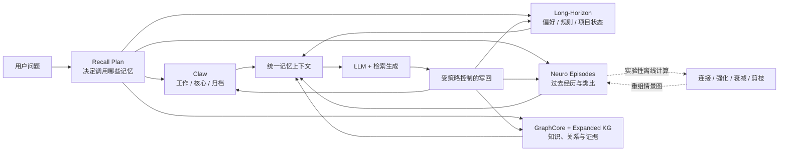

<div align="center">


# DocThinker

**Plastic Memory Runtime · 动态可编辑记忆 · 证据驱动知识演化**

*记忆不只是被保存，也会在使用中被召回、修正、关联和重组。*

[](https://arxiv.org/pdf/2603.05551)
[](LICENSE)
[](http://localhost:5000)
[](#-动态记忆运行时)
[](#-会话级知识图谱与证据演化)

[](https://www.python.org/)
[](https://fastapi.tiangolo.com/)
[](https://flask.palletsprojects.com/)
[](https://networkx.org/)
[](https://github.com/facebookresearch/faiss)

[English](README.md) | [中文](README.zh-CN.md)

</div>

---

## 为什么是 DocThinker？

大多数 Agent Memory 的工作方式是“写入一条记录，再把相似记录检索回来”。DocThinker 关注的是下一步：**记忆写入后还能继续变化吗？**

DocThinker 将对话、文档、检索轨迹、情景经历和知识图谱组织成多层记忆。它不仅让 Agent 跨回合记住信息，还允许用户观察、修正和删除长期状态，并为离线阶段的记忆关联、强化、衰减与剪枝提供实验算法。

当前项目的两个核心方向是：

1. **可控的动态记忆：**记忆不是只追加的黑盒。长期规则和偏好可以被召回、更新、覆盖、删除与审计。
2. **类脑离线巩固：**系统在回答之外分配额外计算，根据内容相似、结构相似、显著性和图关系重新连接经历；强化有效连接，并让弱连接逐渐衰减。这部分目前是实验模块，尚未完整接入主 Web 流程。

文档推理与知识图谱是记忆的重要来源和证据底座，但不是项目的唯一定位。

## 能力状态

我们明确区分已经接通的产品能力、实验模块和后续方向。

| 状态 | 能力 | 当前说明 |
|---|---|---|
| ✅ 已接通 | 跨回合长期规则、偏好与项目状态 | 可在关闭普通聊天上下文后独立召回 |
| ✅ 已接通 | 记忆更新与对照实验 | 新规则可以替代旧规则；可关闭记忆验证增益 |
| ✅ 已接通 | Memory Trace | 展示召回计划、长期状态、情景匹配、候选知识和证据来源 |
| ✅ 已接通 | 情景类比检索 | 深度模式按内容、结构和显著性检索过去经历 |
| ✅ 已接通 | 分层对话记忆 | Claw working/core/archive 三层记忆 |
| ✅ 已接通 | 会话级知识图谱 | 每个会话拥有独立文档、图谱、索引和缓存作用域 |
| ✅ 已接通 | 记忆管理接口 | 支持列出、修改、删除、编辑计划和导出长期记忆 |
| 🧪 实验性 | 离线记忆巩固 | 已有连接、强化、衰减和剪枝算法，尚未接入主 UI/定时任务 |
| 🧪 实验性 | 归纳抽象 | 已有摘要、相似记忆合并和知识聚类，但尚未形成完整可观察归纳链 |
| 🧪 实验性 | KG 关系演化 | ECLRR-v4 可生成并审核证据完整的候选关系 |
| 🧭 后续 | 持久化动态长期记忆 | 默认 Long-Horizon backend 当前是进程级存储，重启会丢失 |
| 🧭 后续 | 统一三类推理轨迹 | 显式记录演绎、归纳、类比的前提、过程、结论和来源 |

> [!IMPORTANT]
> 默认 `InMemoryLongHorizonBackend` 用于本地演示和接口验证，不是生产级持久化存储。生产部署应替换为 SQLite、向量数据库或图数据库 backend。

## 系统如何工作



在线问答闭环由 `AgentMemoryCore` 统一协调：

1. 根据请求开关和查询类型生成召回计划。
2. 从启用的记忆层召回候选信息。
3. 将候选记忆、图谱证据和文档上下文合并为生成指令。
4. 生成回答，并记录本轮记忆路径。
5. 根据写入策略沉淀情景经历、长期状态和候选知识。

<div align="center">

<p><b>图 1.</b> AgentMemoryCore、可插拔 backend、GraphCore、检索生成与回答后写回闭环。</p>
</div>

## 🧠 动态记忆运行时

### 1. AgentMemoryCore

`docthinker.memory_core.AgentMemoryCore` 是统一记忆门面。外部 Agent 可以通过 backend protocols 接入自己的：

- conversation memory；
- episodic memory；
- long-horizon insight memory；
- expanded KG hypotheses；
- graph promotion；
- 可选 chat-turn ingestion。

`MemoryPolicy` 控制启用哪些层、每层召回数量以及是否允许写入。调用方还可以使用 `remember_turn=false` 或 `memory_excluded_layers`，避免敏感或临时信息进入指定记忆层。

### 2. 四类在线记忆

| 记忆层 | 默认实现 | 主要作用 |
|---|---|---|
| 对话记忆 | Claw | 保留近期对话、核心摘要与冷层语义归档 |
| 情景记忆 | Neuro Memory | 保存一次经历的摘要、概念、实体、关系和结构，用于类比 |
| 长期状态 | Long-Horizon backend | 保存偏好、规则、反馈、项目状态和可复用经验 |
| 语义/候选知识 | GraphCore + Expanded KG | 保存文档事实、证据关系和待验证假设 |

### 3. 可观察、可操作的记忆

Query 页面提供本轮 Memory Trace；KG dashboard 提供长期记忆的查看、自然语言编辑计划、确认更新、删除与导出。这样可以区分“模型自己猜到”与“系统确实调用了某条记忆”。

<div align="center">
  
  <p><b>图 2.</b> 记忆路径、长期状态和知识图谱的可观测与管理界面。</p>
</div>

## 🧬 算法设计

### 情景类比检索

Neuro Memory 将每次经历保存为 episode。当前类比评分组合为：

```text
score = 0.60 × 内容相似度 + 0.25 × 结构相似度 + 0.15 × 显著性
```

相似经历作为推理线索注入，不直接当作事实证据。事实结论仍应由文档 chunk 或图谱证据支持。

### 图上的扩散激活

召回可以沿记忆图传播，默认最多三跳。不同关系类型使用不同衰减系数，并记录被共同激活的节点和边，为后续强化提供信号。

### 离线巩固（实验性）

当前代码包含以下离线过程：

1. 从近期经历和高显著性经历中采样。
2. 按内容与结构相似度寻找候选对。
3. 可选地判断 `analogous_to` 或 `same_theme` 关系。
4. 建立双向连接并强化近期激活边。
5. 对长期未激活的弱边执行衰减，并在低于阈值后剪枝。

这对应一种 memory-side test-time scaling：增加回答之外的计算预算来整理记忆，而不是修改模型权重。**目前需要通过独立脚本调用，尚未作为主产品的“一键睡眠”能力。**

### 三类推理源语的当前边界

| 推理源语 | 当前实现程度 | 实现方式 |
|---|---|---|
| 类比 | 较完整 | 内容相似、结构相似、显著性、情景图传播 |
| 归纳 | 部分实现 | 对话摘要、相似长期状态合并、KG 聚类与主题抽象 |
| 演绎 | 辅助实现 | 将召回规则作为约束交给 LLM 执行，尚非符号证明引擎 |

## 🧩 会话级知识图谱与证据演化

每个 session 使用独立 GraphCore workspace，并隔离文档状态、解析缓存、向量索引和答案缓存。GraphCore 提供实体、关系、chunk 和向量混合检索；Expanded KG 保存可被使用和晋升的候选知识。

ECLRR-v4 用于发现和审核缺失关系：

1. 仅在原始事实边上执行 3–8 跳关系感知 beam search。
2. 每一跳通过 `source_id` 回取原文 chunk，并检查引用、位置和方向。
3. Generator 提出候选关系，独立 Judge 审核。
4. 确定性 Gate 检查路径连续性、证据、重复和冲突。
5. 只有通过审核的关系才可写回图谱和向量索引。

<div align="center">
  
  <p><b>图 3.</b> 支持语义缩放和证据检查的知识图谱界面。</p>
</div>

## 🚀 快速开始

### 安装

推荐 Python 3.10 或更高版本。

```bash
git clone https://github.com/Yang-Jiashu/Doc-thinker.git
cd Doc-thinker

conda create -n docthinker python=3.11 -y
conda activate docthinker

pip install -r requirements.txt
pip install -e .
cp env.example .env
```

在 `.env` 中配置使用的 LLM、Embedding 和 VLM 服务。

### 启动 Web UI

```bash
# 终端 1：FastAPI 后端
python -m uvicorn docthinker.server.app:app --host 0.0.0.0 --port 8000

# 终端 2：Flask UI
python run_ui.py
```

默认打开：

- 对话与记忆：`http://localhost:5000/query`
- 记忆图谱：`http://localhost:5000/knowledge-graph`

如果设置了 `UI_PORT`，请使用对应端口。

### Memory Layer API

记忆层可以脱离完整 Web App 嵌入第三方项目。下面是接口结构示意；`my_*_store` 需要由宿主项目实现。

```python
from docthinker.memory_core import AgentMemoryBackends, AgentMemoryCore, MemoryPolicy

memory = AgentMemoryCore(
    backends=AgentMemoryBackends(
        conversation=my_conversation_store,
        episodic=my_episode_store,
        expanded=my_candidate_graph,
        long_horizon=my_long_horizon_store,
        graph=my_semantic_graph,
    ),
    policy=MemoryPolicy(
        episodic_top_k=3,
        expanded_top_k=2,
        long_horizon_top_k=3,
        enabled_layers=("conversation", "episodic", "expanded", "long_horizon", "graph"),
    ),
)

bundle = await memory.recall(
    session_id="research-session",
    query="回答前应该调用哪些过去经验？",
    enable_thinking=True,
)

answer = await my_agent.run(
    "回答前应该调用哪些过去经验？",
    context=bundle.retrieval_instruction,
)

await memory.after_response(
    session_id="research-session",
    question="回答前应该调用哪些过去经验？",
    answer=answer,
    matched_expanded=bundle.expanded_matches,
)
```

更多接入细节见 [`docs/MEMORY_PLUGIN_GUIDE.md`](docs/MEMORY_PLUGIN_GUIDE.md)。

## 查询与文档模式

| UI 模式 | GraphCore 映射 | 当前策略 |
|---|---|---|
| 快速 | `naive` | 轻量检索，关闭 rerank |
| 标准 | `local` | 会话 KG 检索 + rerank；无文档上下文时回退普通对话 |
| 深度记忆 | `mix` | KG + 向量、Claw、情景类比、扩展节点和回答后写回 |

PDF 处理支持以下配置：

| 模式 | 引擎 | 适用场景 |
|---|---|---|
| `vlm` | 云端 VLM | 图片密集文档 |
| `auto` | 短文档使用 VLM，长文档使用 MinerU | 通用文档 |
| `mineru` | MinerU 布局引擎 | 复杂表格和长文档 |

相关引擎需要正确安装并配置 API。项目也支持纯文本摄入。

## 💡 界面示例

<table>
<tr>
<td width="50%" valign="top">

> 上传内容并探索自动构建的知识图谱


</td>
<td width="50%" valign="top">

> 深度模式：分层记忆、情景类比与图谱检索


</td>
</tr>
</table>

## 📡 API 参考

<details>
<summary><b>展开主要端点</b></summary>

| 类别 | 端点 | 方法 | 说明 |
|---|---|---|---|
| 会话 | `/api/v1/sessions` | GET / POST | 列出 / 创建会话 |
| | `/api/v1/sessions/{id}` | GET / PUT / DELETE | 查看 / 修改 / 删除会话 |
| | `/api/v1/sessions/{id}/history` | GET | 聊天历史 |
| | `/api/v1/sessions/{id}/files` | GET | 已上传文件 |
| 上传 | `/api/v1/ingest` | POST | 上传 PDF / TXT |
| | `/api/v1/ingest/stream` | POST | 流式文本上传 |
| 查询 | `/api/v1/query/stream` | POST | SSE 流式查询 |
| | `/api/v1/query` | POST | 非流式查询 |
| | `/api/v1/query/text` | POST | 非流式查询别名 |
| KG | `/api/v1/knowledge-graph/data` | GET | 可视化节点和边 |
| | `/api/v1/knowledge-graph/expand` | POST | 触发 KG 扩展 |
| | `/api/v1/knowledge-graph/eclrr-v4/run` | POST | 运行证据关系精化 |
| | `/api/v1/knowledge-graph/stats` | GET | KG 统计 |
| | `/api/v1/knowledge-graph/expanded-nodes` | GET | 扩展节点生命周期 |
| 记忆 | `/api/v1/memory/stats` | GET | 情景 + Claw 记忆统计 |
| | `/api/v1/memory/dashboard` | GET | 聚合 KG + 记忆状态 |
| | `/api/v1/memory/long-horizon` | GET | 列出长期记忆 |
| | `/api/v1/memory/long-horizon/edit-plan` | POST | 将编辑指令映射到候选记忆 |
| | `/api/v1/memory/long-horizon/{id}` | PATCH / DELETE | 更新 / 删除长期记忆 |
| | `/api/v1/memory/long-horizon/export` | GET | 导出审计索引 |
| 设置 | `/api/v1/settings` | GET / POST | 运行时配置 |

</details>

## 📂 项目结构

| 目录 | 说明 |
|---|---|
| `docthinker/memory_core/` | 统一记忆门面、protocols、策略和 Long-Horizon 默认实现 |
| `claw/` | working/core/archive 分层对话记忆 |
| `neuro_memory/` | episode、类比检索、扩散激活和实验性离线巩固 |
| `docthinker/kg_expansion/` | 候选知识、聚类、使用记录与晋升 |
| `graphcore/` | 知识图谱、向量检索、chunk 和证据关系 |
| `docthinker/server/` | FastAPI 服务与查询闭环 |
| `docthinker/ui/` | 对话、记忆路径和知识图谱界面 |
| `packages/docthinker-memory/` | 可嵌入第三方 Agent 的轻量 package skeleton |

## 📝 引用

如果 DocThinker 对您的研究有帮助，请引用：

```bibtex
@article{yang2026autothinkrag,
  title={AutothinkRAG: Complexity-Aware Control of Retrieval-Augmented Reasoning for Image-Text Interaction},
  author={Yang, Jiashu and Zhang, Chi and Wuerkaixi, Abudukelimu and Cheng, Xuxin and Liu, Cao and Zeng, Ke and Jia, Xu and Cai, Xunliang},
  journal={arXiv preprint arXiv:2603.05551},
  year={2026}
}
```

## 🤝 贡献

欢迎 PR 和 Issue！详见 [CONTRIBUTING.md](CONTRIBUTING.md)。

## 📜 协议

当前及未来版本采用 [PolyForm Shield License 1.0.0](LICENSE)。该源码可见许可允许在许可范围内使用、研究、修改和分发，但不得用本软件提供与 DocThinker 或许可方相关产品和服务相竞争的产品。超出该范围的商业使用，请联系项目维护者获取商业许可。

此前已按 MIT 发布的历史版本继续适用其原始许可；除非具体文件或版本另有说明，本仓库当前及后续版本适用 PolyForm Shield 1.0.0。
