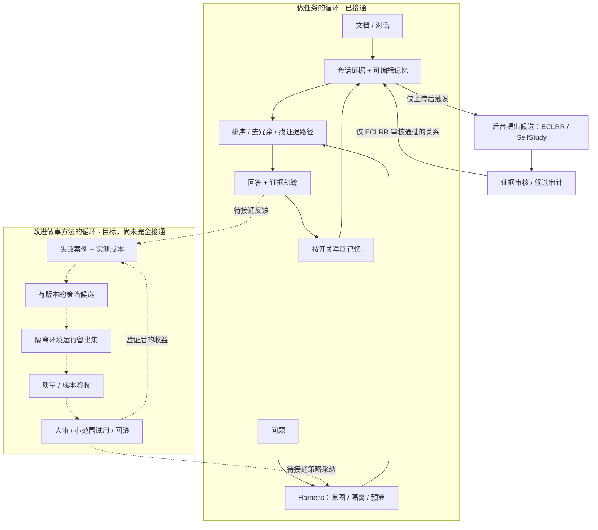

<div align="center">

# DocThinker

**从证据与记忆出发，走向可验证的递归自我改进。**

一条面向 RSI（Recursive Self-Improvement）的研究路径

[English](README.md) · [快速开始](#快速开始) · [架构](docs/ARCHITECTURE.md) · [RSI 路线图](docs/RSI_ROADMAP.md)

[](pyproject.toml)
[](https://github.com/Yang-Jiashu/Doc-thinker/actions/workflows/ci.yml)
[](https://arxiv.org/abs/2603.05551)
[](LICENSE)

</div>

## 为什么做这个项目

**DocThinker 的最终目标是探索 RSI，不只是做一个文档聊天工具，也不只是让知识图谱越来越大。** 我们要研究的是：系统能否从任务中积累经验，提出对自身工作方法的改动，验证改动确实有用，再利用这些结果提高下一轮的改进能力。

文档问答是起点与试验场。可追溯的证据、可编辑的记忆、有预算的检索、后台知识整理，为这条路径提供基础；但“知识更多”不自动等于“能力更强”。

**现在能运行：**文档问答、分层记忆、受控推理路径、候选生成、离线质量与成本验收。**下一个里程碑：**候选版本化 → 隔离评测 → 审核采纳 → 可回滚。这个部署闭环尚未全部接通，具体交付标准见 [RSI 路线图](docs/RSI_ROADMAP.md)。

## 现在可以用它做什么

| 你想做的事 | 系统如何处理 |
|---|---|
| 按原文回答 | 检索原始证据；缺证据时说明缺口，不靠补边凑答案 |
| 理清多步关系 | 在有限图邻域中寻找有方向、连续的路径，展示来源；连通不等于因果成立 |
| 探索新思路 | 用图排序与去冗余选择关联线索，保留其“假设”身份 |
| 记住规则和偏好 | 长期记忆可查看、编辑、删除和版本恢复，并通过独立开关控制 |
| 做对照实验 | 分别关闭记忆、聊天上下文、LLM 缓存、自进化，并查看本轮策略与预算 |

文档是证据，记忆是辅助信息，模型生成的关联是候选，三者不能混为一谈。已有上传后后台学习；情景记忆的“夜间巩固”仍是独立实验流程，与上传触发不是同一个机制。

## 两个循环，一个方向


```mermaid
flowchart TD
    subgraph Runtime["做任务的循环 · 已接通"]
        U["文档 / 对话"] --> S["会话证据 + 可编辑记忆"]
        Q["问题"] --> H["Harness：意图 / 隔离 / 预算"]
        H --> R["排序 / 去冗余 / 找证据路径"]
        S --> R
        R --> A["回答 + 证据轨迹"]
        A --> W["按开关写回记忆"]
        W --> S
    end
    S -->|仅上传后触发| C["后台提出候选：ECLRR / SelfStudy"]
    C --> D["证据审核 / 候选审计"]
    D -->|仅 ECLRR 审核通过的关系| S
    subgraph Improvement["改进做事方法的循环 · 目标，尚未完全接通"]
        F["失败案例 + 实测成本"] -.-> V["有版本的策略候选"]
        V -.-> E["隔离环境运行留出集"]
        E -.-> G["质量 / 成本验收"]
        G -.-> P["人审 / 小范围试用 / 回滚"]
        P -.验证后的收益.-> F
    end
    A -.待接通反馈.-> F
    P -.待接通策略采纳.-> H
```

实线是已有接线，虚线是待接通的改进闭环。其中质量 / 成本验收已提供 [离线工具](docs/SELF_EVOLUTION_EVALUATION.md)，但不会代替实验执行与部署。

骨架由程序负责：隔离、筛选、路径、预算、调度、验收。LLM 负责语义提取、回答表达和可选候选生成。**第一阶段改进的是 Harness 与检索策略，不要求先改模型权重。**

## 快速开始

推荐 Python 3.11，从仓库以 editable 模式安装。解析依赖较大，首次安装与模型下载可能较慢。

```bash
git clone https://github.com/Yang-Jiashu/Doc-thinker.git
cd Doc-thinker
python3.11 -m venv .venv
source .venv/bin/activate
python -m pip install -e ".[all]"
cp -n env.example .env
```

编辑 `.env`，使用你实际可访问的服务；不要提交密钥。

| 配置 | 要检查什么 |
|---|---|
| `LLM_BINDING_HOST`、`LLM_BINDING_API_KEY`、`LLM_MODEL` | 回答模型与兼容的服务地址 |
| `KEYWORD_LLM_MODEL`、`ENTITY_EXTRACTION_LLM_MODEL` | 同一服务可用的模型；可以与回答模型相同 |
| `EMBEDDING_BINDING_HOST`、`EMBEDDING_BINDING_API_KEY`、`EMBEDDING_MODEL`、`EMBEDDING_DIM` | 输出维度必须与配置一致 |
| `VLM_MODEL` | 使用图像 / 多模态处理时可用的视觉模型 |
| `RAG_WORKDIR` | 默认 `./rag_storage_api`；长期记忆默认保存在其中的 SQLite 文件 |

启动两个终端，先只监听本机：

```bash
# 终端 1：后端
python -m uvicorn docthinker.server.app:app --host 127.0.0.1 --port 8000

# 终端 2：界面，避开 macOS 可能占用的 5000 端口
UI_HOST=127.0.0.1 UI_PORT=5001 python run_ui.py
```

打开 [对话界面](http://127.0.0.1:5001/query)、[知识图谱与记忆](http://127.0.0.1:5001/knowledge-graph) 或 [API 文档](http://127.0.0.1:8000/docs)。UI 代理默认连接本机 8000 端口。远程部署前需另行配置认证、反向代理与访问控制。

**第一次使用：**新建会话 → 上传一份 TXT → 等待处理完成 → 选择“忠实原文”提问 → 打开“回答依据”查看证据。确认文本流程后再配置 PDF / 图像处理。启动探测、上传提取和后台学习可能调用模型；查询开关不是全局停用模型的开关。

## 界面与实验

采用 Codex 风格的克制工作台：灰白侧栏、会话列表、专注的对话区域、简洁输入框，以及按需展开的证据面板。保留 DocThinker 自身标识，与 OpenAI 无隶属关系。

回答目标放在主界面：自动、忠实原文、查找路径、探索关联。检索深度与实验参数放在进阶面板，避免把“查得多”误当成“答得更可靠”。

- 四个开关分别控制，互不替代；关闭上下文不等于关闭长期记忆。
- 精简上下文默认开启；额外 LLM 补链、已审核补边参与默认关闭。
- “回答依据”展示本轮策略、预算和证据，手机上也可打开。
- “忠实原文”不使用扩展假设；普通聊天仍可使用已启用的历史和记忆。

完整参数与可复制请求见 [查询运行指南](docs/QUERY_RUNTIME.md)。

## 自进化实现到了哪一步？

| 状态 | 能力 |
|---|---|
| 已接通 | 会话隔离、分层记忆、证据检索、查询预算、受控写回与 Memory Trace |
| 已接通，效果待验证 | 上传后 ECLRR 候选审核；SelfStudy 的图修改候选仅保留审计，不覆盖原文节点描述；经验另行保存 |
| 离线工具 | 分题型、兼顾质量与成本的候选验收；只给复核建议，不自动修改线上策略 |
| 实验模块 | 情景巩固的连接、强化、衰减、剪枝；SEAL / TriGraph 等独立路径 |
| 尚未形成 | 独立评测驱动的策略晋升、完整版本回滚、持续验证的 RSI 闭环 |

**目标是在质量与成本约束下，让任务能力真正提高。** 探索模式保留有用的发散，忠实模式不被联想污染。下一阶段必须能修改并评测一种做事策略，而不只是增加关系。瓶颈见 [架构评估](docs/ARCHITECTURE.md)，实施顺序见 [RSI 路线图](docs/RSI_ROADMAP.md)。

## 效率：改了什么，还缺什么

- 在线请求有边界：上下文预算、局部图遍历、批量读取、请求内边评分复用、证据去冗余。
- 后台学习有约束：同会话上传学习合并、串行执行，不同会话限制并发；SelfStudy 增加调用次数、超时与估算 token 准入控制。
- 能用算法的步骤不额外调用生成模型：隔离检查、规则路由、PPR、MMR、路径搜索。
- 还需完善：所有模型入口的真实费用计量、持久化作业、增量图更新、大数据性能实测，以及版本化—评测—采纳—回滚闭环。

这不表示“整个架构已优化完”。操作次数减少不等于真实时延或账单同比下降；大规模实验前请先看 [成本边界与验证方法](docs/ARCHITECTURE.md#效率边界与验证方法)。

## 开发与验证

```bash
python -m pip install -e ".[all,test]"
python -m pytest tests/ -q --ignore=tests/debug_db.py

# 不调用 LLM；输入格式和独立评分要求见评测指南
python -m docthinker.evaluation --baseline baseline.json --candidate candidate.json
```

只想先看新版界面，可运行 `PYTHONPATH=. python tests/ui_preview.py`，再打开 [本地预览](http://127.0.0.1:5055/query)。这是模拟数据，不连接模型、不保存真实资料，也不能用来验证回答质量。

单元测试使用模拟模型与合成证据，不证明真实回答质量或实际 token 节省。词面评分只用于初筛，不能判断反义、因果成立或真实事实支持。

## 文档导航

| 文档 | 内容 |
|---|---|
| [架构与效率](docs/ARCHITECTURE.md) | 在线 / 后台职责、成本边界、当前缺口 |
| [RSI 路线图](docs/RSI_ROADMAP.md) | 改进对象、算法闭环、里程碑与验收条件 |
| [查询运行指南](docs/QUERY_RUNTIME.md) | 模式、开关、预算与 A/B 请求 |
| [自进化评测](docs/SELF_EVOLUTION_EVALUATION.md) | 留出集、评分标准、离线验收格式 |
| [记忆集成指南](docs/MEMORY_PLUGIN_GUIDE.md) | 将 `AgentMemoryCore` 接入其他 Agent |
| [贡献指南](CONTRIBUTING.md) | 开发协作 |

主要入口：`docthinker/harness.py` 管查询策略；`docthinker/memory_core/` 管记忆；`graphcore/` 管证据；`docthinker/server/routers/ingest.py` 管上传后的学习；`docthinker/ui/` 管界面。

## 引用与许可

```bibtex
@article{yang2026autothinkrag,
  title={AutothinkRAG: Complexity-Aware Control of Retrieval-Augmented Reasoning for Image-Text Interaction},
  author={Yang, Jiashu and Zhang, Chi and Wuerkaixi, Abudukelimu and Cheng, Xuxin and Liu, Cao and Zeng, Ke and Jia, Xu and Cai, Xunliang},
  journal={arXiv preprint arXiv:2603.05551},
  year={2026}
}
```

当前版本采用 [PolyForm Shield License 1.0.0](LICENSE)，使用与分发请遵守许可条款。历史 MIT 版本继续适用其原始许可。
