# EMBARK ON

# YOUR JOURNEY WITH

# BUSINESS SCHOOL

BACHELOR OF BUSINESS ADMINISTRATION

# CONTENTS

At A Glance 01  
You Deserve The Best 02  
An Agile Experience 03  
Academic 04  
Curriculum Roadmap 05  
Nine Majors, Infinite Possibilities 06  
2nd Majors and Minors 07  
Global & Experiential 09  
Global Immersion 10  
Case Competitions 11  
Campus Living & Bizad Club 12  
Industry Relevant 13  
What Our Graduates Do 16  
Leadership & Lifelong Learning 17  
Entrepreneurial 19  
Be An Entrepreneur 20  
Admissions, Scholarships & Financial Aids 21

# AT A GLANCE

Embark on a rewarding journey at NUS Business School and surround yourself in a community of vibrant, diverse, and passionate individuals. Enjoy the prestige and pride of learning alongside bright and dedicated people who constantly strive to push boundaries in business ideation. Being part of NUS Business School is more than just an education - it could be a life-changing experience.

# FINDINGS FROM 2022 GRADUATE EMPLOYMENT SURVEY*

*For this graduate cohort, the three degree programmes were accounted for separately as Bachelor of Business Administration, Bachelor of Business Administration (Accountancy) and Bachelor of Science (Real Estate). From 2024, all students will be enrolled into the Bachelor of Business Administration degree through a common admission.

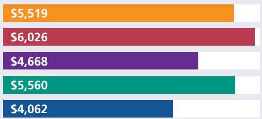  
GROSS MONTHLY SALARY FOR GRADUATE YEAR 2022 (MEAN)

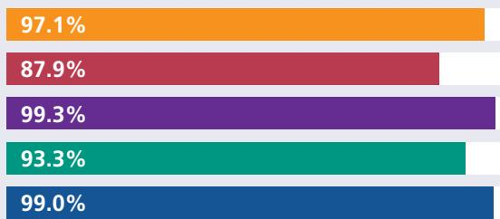  
OVERALL EMPLOYMENT FOR GRADUATE YEAR 2022 (WITHIN 6 MONTHS OF GRADUATION)

BBA (Hon) - Bachelor of Business Administration (Honours)

BBA - Bachelor of Business Administration

■ BAC (Hon) - Bachelor of Business Administration (Accountancy) (Honours)  
BAC - Bachelor of Business Administration (Accountancy)  
BSc RE - Bachelor of Science (Real Estate)

4,350

TOTAL BBA STUDENTS

OVER 55,000 STRONG ALUMNI NETWORK

59 YEARS OF DEVELOPING BUSINESS LEADERS

# YOU DESERVE THE BEST

We are a highly-ranked business school that provides each student the best preparation and springboard towards a promising career.

1st

IN ASIA

according to the QS World University rankings for 2024.

# NUS BUSINESS

Ranked among the world's best

TIMES HIGHER EDUCATION
UNIVERSITY RANKING 2023

3rd

IN ASIA

QS WORLD UNIVERSITY RANKINGS 2023

$8^{\text{th}}$

IN THE WORLD

1st

IN ASIA

US NEWS &

WORLD REPORT 2023

2nd

IN ASIA

# BUSINESS SUBJECT RANKINGS

TIMES HIGHER

EDUCATION

WORLD UNIVERSITY

RANKING 2023

11th

BUSINESS &

ECONOMICS

THE WORLD UNIVERSITY RANKINGS

(IN ASIA) BY SUBJECTS 2022

1st

ACCOUNTING

& FINANCE

1st

BUSINESS &

MANAGEMENT STUDIES

QS WORLD UNIVERSITY RANKINGS (GlobALLY BY SUBJECTS 2023)

$9^{\text {th }}$

MARKETING

$13^{\text{th}}$

BUSINESS &

MANAGEMENT STUDIES

$10^{\text{th}}$

BUSINESS

ANALYTICS

14th

ACCOUNTING

& FINANCE

NUS MBA

1st

IN ASIA

QS BUSINESS MASTERS RANKINGS

$10^{\text{th}}$

GLOBAL

QS GLOBAL MBA RANKINGS

$24^{\text{th}}$

GLOBAL

# MBA PROGRAMME RANKINGS

UCLA-NUS JOINT PROGRAMMES QS

3rd

IN EMBA 2023

FINANCIAL TIMES MBA RANKINGS

$25^{\text{th}}$

IN MBA 2023

POETS & QUANTS INTERNATIONAL MBA RANKINGS

2022-2023

1st

IN ASIA

$5^{\text {th }}$

GLOBAL

# AN AGILE EXPERIENCE

# YOUR AGILE APPROACH TO EDUCATIONAL EXCELLENCE!

Be equipped with A.G.I.L.E. capabilities tailored for the demands of a Volatile, Uncertain, Complex, and Ambiguous (VUCA) world. You get to cultivate various skill sets across the many disciplines, empowering you with the expertise to navigate and address new business challenges.

JOIN US and thrive in the face of volatility with the confidence and competence instilled by NUS Business School.

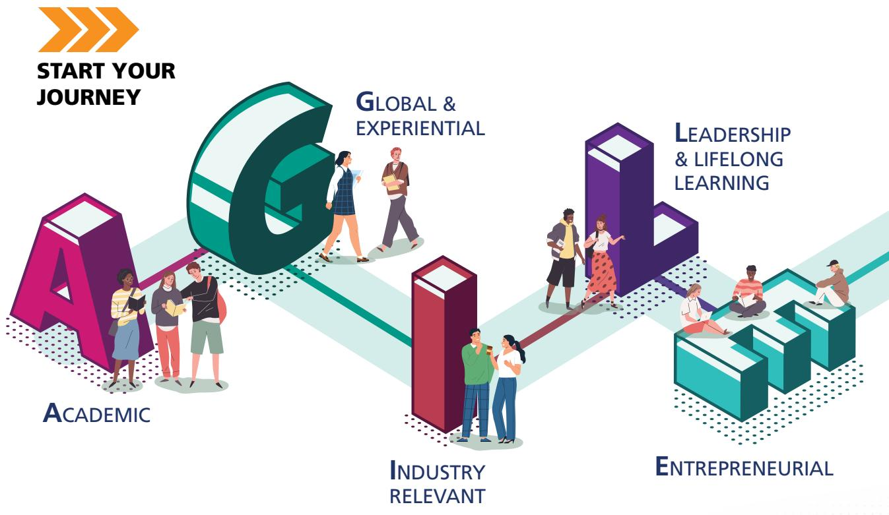

# ACADEMIC

Our curriculum promises the most customisability, with options to pursue a 2nd major and minor, as well as cross-disciplinary studies. Upon graduation, you will be equipped with skills spanning various professional fields.

COMMON CURRICULUM

52UNITS

# General Education Courses 24 Units

Cultures and Connections  
- Critique and Expression  
Data Literacy  
Digital Literacy  
Singapore Studies  
Communities and Engagement

# Cross Disciplinary Course -Field Service Project 8 Units

Work Experience Milestone

# Business Environment Courses

# 20 Units

Legal Environment of Business  
Managerial Economics  
Decision Analytics using Spreadsheets  
Business Communication for Leaders  
Introduction to Real Estate  
- Ethics in Business

Global Experience Milestone

MAJOR CURRICULUM

Business Majors* 60 UNITS

Accountancy Major 68 UNITS

Real Estate Major 64UNITS

# Level 2000, 3000 and 4000 Courses:

Accountancy

Applied Business Analytics*

Business Economics*

Finance*

Innovation & Entrepreneurship*

Leadership & Human Capital Management*

Marketing*

Operations & Supply Chain Management*

Real Estate

# UNRESTRICTED ELECTIVE COURSES

Business Majors 48 UNITS

Accountancy Major 40 UNITS

Real Estate Major 44UNITS

Embark with us on an A.G.I.L.E. journey with multiple opportunities to acquire both in-depth business and cross-disciplinary expertise.

With a curriculum that is at least a quarter of unrestricted electives, students have a higher degree of freedom to broaden their university education and enhance their learning experience.

# NINE MAJORS, INFINITE POSSIBILITIES:

# SHAPE YOUR EDUCATION, SHAPE YOUR FUTURE!

# ACCOUNTANCY

Managerial Accounting  
Corporate Accounting & Reporting  
Accounting Information Systems  
Assurance and Attestation  
Corporate and Securities Law  
Taxation  
Governance, Risk Management and Sustainability  
Advanced Corporate Accounting and Reporting  
Accounting Analytics and AI

# APPLIED BUSINESS ANALYTICS

Predictive Analytics in Business  
Stochastic Models in Management  
Statistical Learning for Managerial Decision  
Analytical Tools for Consulting  
Marketing Analysis and Decision-making  
Big Data Techniques and Technologies  
Social Media Network Analysis

# BUSINESS ECONOMICS

Macroeconomic Principles in the Global Economy  
Econometrics for Business I  
Innovation & Productivity  
Predictive Analytics in Business  
Game Theory & Strategic Analysis  
Business-driven Technology  
Psychology and Economics

# FINANCE

Investment Analysis & Portfolio Management  
International Financial Management  
- Options and Futures  
Risk and Insurance  
Financial Markets  
AI Blockchain and Quantum Computing

# INNOVATION & ENTREPRENEURSHIP

Technological Innovation  
New Venture Creation  
- Entrepreneurial Strategy  
Social Entrepreneurship  
New Product Development  
Innovation & Intellectual Property

# LEADERSHIP & HUMAN CAPITAL MANAGEMENT

Leading in the 21st Century  
Organisational Effectiveness  
Business with a Social Conscience  
Leading Across Borders  
HR Analytics and Machine Learning

# MARKETING

Marketing Strategy: Analysis and Practice  
Consumer Behaviour  
Product & Brand Management  
Services Marketing  
SME Marketing Strategy  
Advertising & Promotion Management  
AI in Marketing

# OPERATIONS & SUPPLY CHAIN MANAGEMENT

Service Operations Management  
Physical Distribution Management  
Sustainable Operations Management  
Strategic Information Systems  
Supply Chain Management

# REAL ESTATE

Land Law  
Urban Economics  
Real Estate Investment Analysis  
Urban Planning  
Principles of Real Estate Valuation  
REIT and Business Trust Management

# 2ND MAJORS AND MINORS

# WHAT POSSIBILITIES ARE THERE?

Our students have the capacity to pursue more possibilities of cross-disciplinary studies within the standard candidature using their pool of unrestricted elective units. They can embark on a second major and/or minors within or outside of NUS Business School. Give it a try!

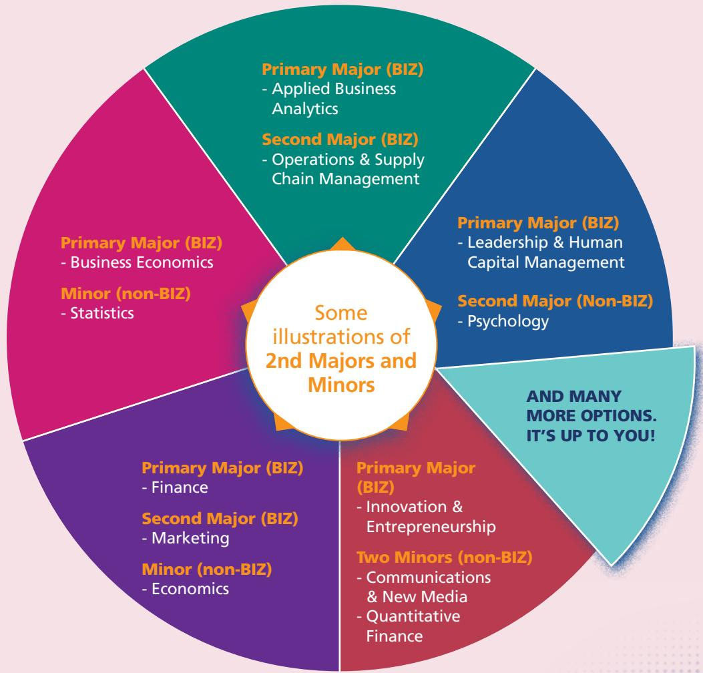

DID YOU KNOW?

NUS has a grade-free scheme where you can ensure your grades don't impact your GPA for that semester. This allows for our students to transit into university life academically and socially.

# DOUBLE DEGREE PROGRAMME

Are you a highly motivated student with an interest in two complementing disciplines? You may consider the Double Degree programme (DDP). Choose from the following options:

Business Analytics  
Communications & New Media  
Computer Science  
Economics  
Engineering

Information Systems  
Law  
NUS - PKU Extended Exchange  
Others

* Students may apply to pursue self-initiated DDP combinations after the first year of study.

https://bba.nus.edu.sg/academic-programmes/dcdp/ddp/ad-hoc-double-degrees/

# CONCURRENT DEGREE PROGRAMME

The Concurrent Degree programme (CDP) is similar to the Double Degree programme in duration. In a DDP, the student is awarded two Bachelor degrees upon graduation. However, for a CDP, the student is awarded a Bachelor and a Master's degree upon completion. A student may choose from the following options:

# BACHELOR & MASTERS DEGREE

- Master in Public Policy (with Lee Kuan Yew School of Public Policy)  
- Master of Science in Management

https://bba.nus.edu.sg/academic-programmes/dcdp/cdp/mpp/

FOR MORE INFORMATION ON CURRICULUM, PLEASE SCAN HERE!

As required components in the BBA curriculum, students will be able to meaningfully expand their horizons, and graduate as global-minded, culturally aware individuals, who have gained relevant work experience to thrive in highly diverse work environments.

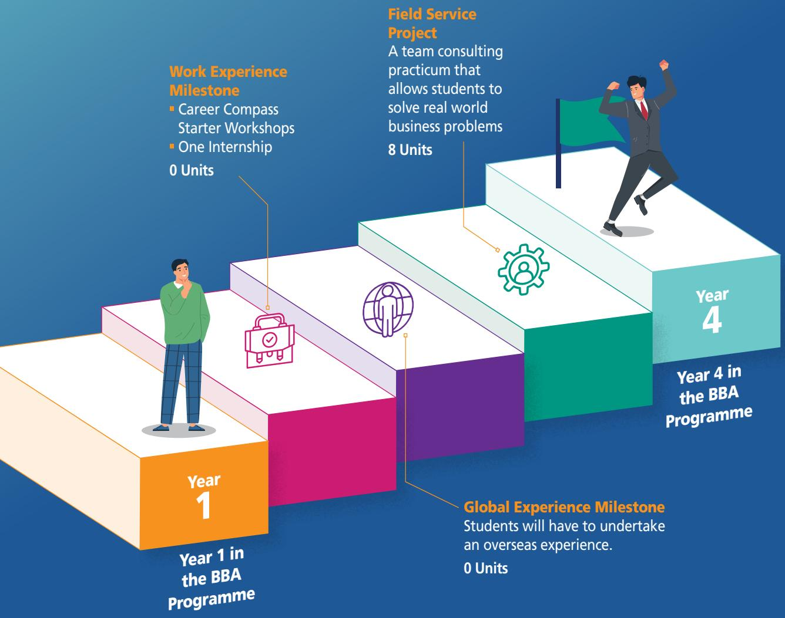

# GLOBAL IMMERSION

# STUDENT EXCHANGE PROGRAMME (SEP)

Students spend a semester reading courses at an overseas partner university, and in doing so, gain invaluable experiences abroad in a different cultural environment that broadens their outlook and approach to doing business. Students can also choose from a wide array of summer or winter programmes which are shorter in duration than SEP.

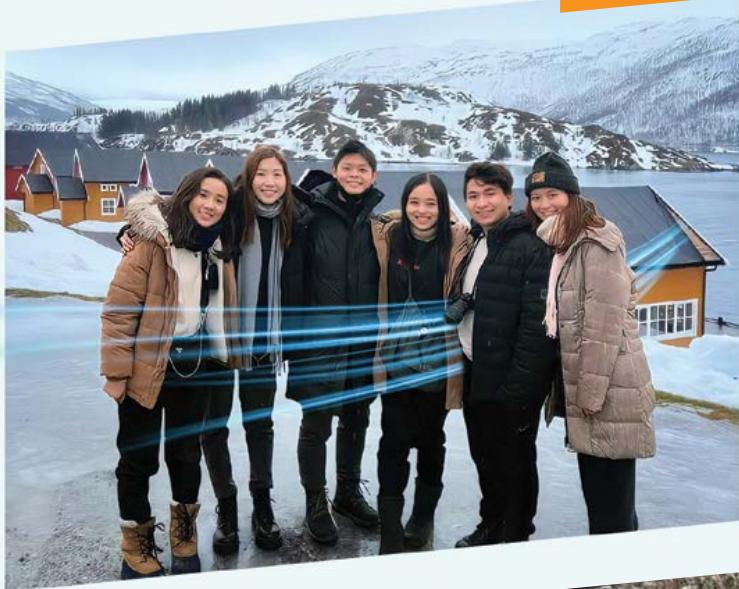

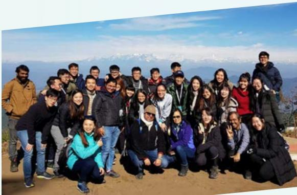

# STEER PROGRAMME

The STEER programme is designed to build and cultivate familiarity and interests in burgeoning economies in India, the Middle East, Vietnam, China and Brazil.

https://www.nus.edu.sg/gro/global-programmes/special-global-programmes/steer

# NUS OVERSEAS COLLEGE

A prestigious entrepreneurship development programme that gives NUS students opportunities to work and study in leading entrepreneurial and academic hubs for up to a year.

https://bba.nus.edu.sg/academic-programmes/special-programmes/nus-overseas-colleges/

  
FOR MORE INFORMATION, SCAN HERE!

# GROWING FROM STRENGTH TO STRENGTH

# HOME-GROWN COMPETITIONS

NUS Business School hosts our very own competitions on a local and international scale. These competitions engage students from local and overseas universities, and are excellent focal points for students to congregate, exchange and share inspiring ideas across borders.

# ACROSS THE YEARS,

# WE HAVE PARTICIPATED IN:

NUS-Shell Case Competition  
UOB-NUS International Case Competition  
BI Norwegian Business School Case Competition  
CBS Case Competition  
Belgrade International Business Case Competition  
NUS-SP Group Case Competition  
- Nestle-NUS Innovation Challenge  
John Molson Undergraduate Case Competition  
RSM STAR Case Competition  
International Case Competition @ Maastricht

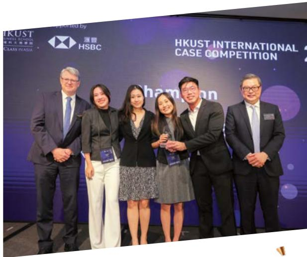

2023 THAMMASAT UNDERGRADUATE BUSINESS CHALLENGE

2ND RUNNER-UP

2023 HONG KONG UNIVERSITY OF SCIENCE AND TECHNOLOGY INTERNATIONAL CASE

COMPETITION CHAMPIONS

2023 JOHN MOLSON UNDERGRADUATE CASE COMPETITION

2ND RUNNER-UP

2023 RSM STAR CASE COMPETITION

CHAMPIONS

2023 CENTRAL EUROPEAN CASE COMPETITION

2ND RUNNER-UP

# CAMPUS LIVING

Immerse yourself in a dynamic campus life brimming with a diverse range of residential options and programmes tailored just for you. Discover countless opportunities that not only enrich your education but also connect you to vibrant communities. Forge lifelong friendships that will support and accompany you on your unique path through both life and career adventures. Your extraordinary experience begins here!

# HALLS & RESIDENCES:

Eusoff Hall  
Kent Ridge Hall  
King Edward VII Hall  
Prince George's Park Residences & Houses  
Raffles Hall  
Sheares Hall  
Temasek Hall

# BIZAD CLUB

Step into a world crafted just for you by becoming a part of the NUS Students' Business Club – your gateway to an exceptional student experience! As the ultimate student organisational hub, we offer you the ideal platform to cultivate lifelong skills and build meaningful connections. Immerse yourself in the excitement of flagship events like the Bizad Charity Run and Freshmen Orientation Projects, designed to infuse energy into your student life. Join us on this journey of empowerment, where every moment is dedicated to enhancing your personal and professional growth.

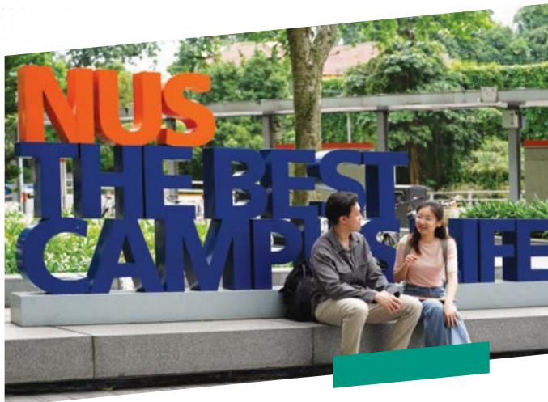

# RESIDENTIAL PROGRAMMES:

College of Alice and Peter Tan (CAPT)  
NUS College (NUSC)  
Residential College 4  
Ridge View Residential College  
Tembusu College

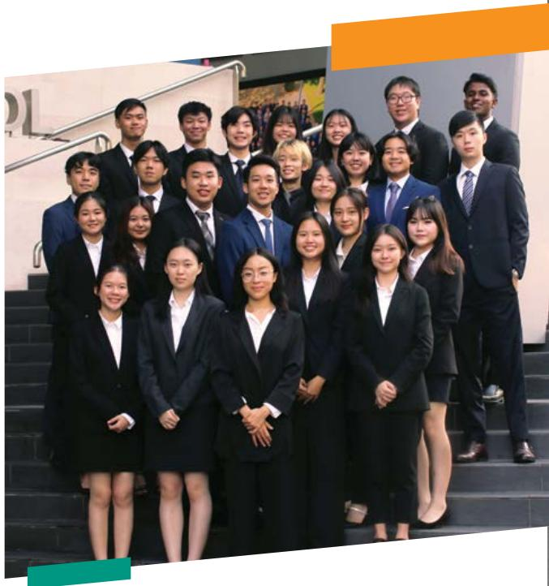

# NDUSTRY

# RELEVANT

Dive into an immersive Career Compass Starter Workshop where you gain valuable skills in interview and resume-writing, together with industry-focused experiences through internships and work-study programmes. This dynamic combination ensures you emerge market-ready and a highly sought-after job candidate.

sought-after Job candidaYour journey to success starts with a programme designed to set you apart and open doors to exciting opportunities!

# BUSINESS SCHOOL BizCAREERS

NUS Business School students are highly sought after by global and local companies. Our BIZCareers team works closely with students to help them achieve their career objectives, while actively engaging and fostering close partnerships with recruiters across the major industries to bring meaningful opportunities to our students.

Alumni Sharing Sessions  
Booster Skills Workshops  
Company Visits  
Career & Recruitment Talks  
Career & Internship Fairs  
- Internship & Job Search Briefings  
Industry Awareness Series

# INTERNSHIPS

Internships are a crucial part of university education. Students are encouraged to embark on internships with many taking up at least two internships during their time at NUS.

At NUS Business School, an internship will be a graduation requirement for students under the new curriculum. Students will gain real world industry experience, with the option to obtain units or not.

# Credit-bearing Internships:

# BI3704

8-week internship

# BI3708

16-week internship

# BI3712

24-week internship

# BI3003

8-week internship

(for non-business/accounting/real estate related internships)

https://bba.nus.edu.sg/academic-programmes/general-academic-matters/business-internship-courses/

Industry Specific Skills Workshops  
Individual Career Advisory sessions  
Individual Mock Interview sessions  
Individual Internship & Job Search Strategies  
Career Guides

# CAREER COMPASS STARTER WORKSHOPS

Unlock your future potential with the Career Compass Starter Workshops as we guide you in cultivating the skills essential for your career. Tailored to your needs, we are here to support you on your journey, empowering you to achieve your unique career goals.

# Year 1

Strategic Career Planning  
Resume & Cover letter Writing  
Personal Branding  
Networking Skills  
Interviewing Skills  
- Dealing with Others in the Workplace

Year 2 (led by Career Advisors)

Small Group Resume Clinics  
Small Group Mock Interview Clinics

# FIELD SERVICE PROJECT

The Field Service Project (FSP) course is all about teaming up for a hands-on learning adventure. Imagine working with an organisation in Singapore, or beyond, and getting insights straight from the CEOs and industry leaders themselves. It's not your typical classroom experience; handling real-world business issues, diving into business challenges beyond your regular NUS lessons.

For FSP, you immerse yourself in an organisation's business model, grasp their value propositions, and witness the intricate workings of their operations. However, it goes beyond mere tasks. FSP becomes your backstage pass to awesome networking. You're not just there to observe, but instead you will actively participate, lending your contribution through a perceptive report guided by a supervisor. This is your opportunity to assist them in navigating the complexities of today's business landscape. Will you grab it?

https://bba.nus.edu.sg/academic-programmes/general-academic-matters/field-service-project/

# WORK STUDY INTERNSHIP PROGRAMME

Work Study Internship Programme (WSIP) isn't your typical learning experience; it's a uniquely tailored, hands-on opportunity designed specifically for business students like yourself. Imagine this: instead of sticking to traditional classrooms and textbooks, you're enrolled in a long-term, credit-bearing work-study programme. What sets it apart? It's a personalized journey crafted in collaboration with professional and commercial organisations. While excelling in classroom courses, WSIP immerses you in the real-world action with structured work placements at actual companies.

But wait, there's more! During your WSIP adventure, you'll connect with workplace mentors, delve into your chosen field, and gain a wealth of real-world experience. Some students may even enjoy progressive stipends, job rotations, and a fast track to entry-level career options upon graduation. Ready to transform your education into an exciting adventure? Let's dive in!

# WHAT OUR GRADUATES DO

# ACCOUNTANCY

Accountant  
Auditor  
Forensic Accountant  
Risk Advisory  
Tax Advisory

# EVENTS & HOSPITALITY

Accounts Executive  
Conference Management  
Marketing Executive  
- Optimisation Analyst

# E-COMMERCE

Analyst, Branding & Marketing  
Executive Enterprise Sales Account  
Management Associate  
Onboarding & Team Coordinator  
Regional Operations Associate

# HUMAN CAPITAL MANAGEMENT

Executive Search  
Management Associate  
- Talent Acquisition

# OTHER SECTORS

Civil and Public Service  
Healthcare  
Marine  
Aviation  
FinTech  
Telecommunications

# CONSULTING

Business Analyst  
Clients & Markets Analyst  
- Consulting Analyst  
HR Analyst  
Management Consultant  
Programmer Analyst  
Research Consultant  
Strategy Analyst  
Transaction Advisory Associate

# CONSUMER GOODS

- Advertising Brand Manager  
Content Executive  
Digital Marketing Executive  
Marketing and Communications Executive  
Sales and Marketing Executive

# TECHNOLOGY

Business Operations & Strategy  
Data Analyst  
Google Squared Data and Analytics Programme  
Order Management Specialist  
Partner Manager  
Product Messaging Analyst  
Project Executive  
Purchasing Analyst  
R&D Engineer

# LOGISTICS, MANUFACTURING & SUPPLY CHAIN

Operations Associate  
Accounts Coordinator  
Business Development  
Inventory Management  
Market Intelligence

# FINANCE & BANKING

Analyst for Commercial Banking  
Credit  
Global Investment Management  
Global Transaction Services  
Global Markets  
Investment Banking  
Macro Sales  
Operations & Technology  
Trade Solutions  
Treasury  
Venture Capital  
Commodity Associate  
Global Markets Trader  
Investment Support  
Wealth Management

# REAL ESTATE

Real Estate Finance & Investment  
Real Estate Fund Management - Business Development, Acquisitions & Deal Structuring  
Real Estate Investment Trusts  
Town Planning & Urban Management  
Asset Management  
Corporate Real Estate Management  
Real Estate Development & Entrepreneurship  
Real Estate Consultancy, Valuation & Marketing  
Property & Facilities Management

# LEADERSHIP &

# LIFELONG LEARNING

To foster leadership qualities in the fast-changing corporate world, students will be immersed in a wide range of robust learning opportunities to develop the leader in each of them. The School also seeks to make lifelong learners out of every student, armed with knowledge acquisition skills and a hunger to continually grow.

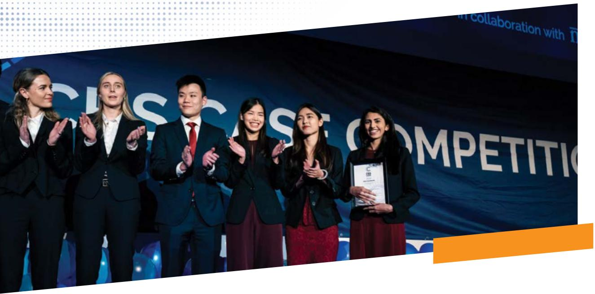

# NURTURING AGILE LEADERS WITH MARKETPLACE IMPACT AND DRIVE FOR LIFE LONG LEARNING

# COURS ON LEADERSHIP

Leadership & Decision Making under Certainty

Leading in the 21st Century

Leading Accross Borders

Business with a Social Conscience

# MAJOR IN LEADERSHIP & HUMAN CAPITAL MANAGEMENT

In this major, you become the linchpin of organisations and teams. Understand leadership and position yourself at the central node of influence. Inspire people, shape organisational outcomes, and unlock the full potential of human capital—all within your grasp. This places you in the driver's seat of leadership, where you catalyse change and drive success.

# NUS LIFELONG LEARNING

As part of the NUS Lifelong Learners programme, student enrolment is valid for 20 years from the point of undergraduate/ postgraduate admission. As such, all current and future students are automatically eligible for the NUS Lifelong Learning programme upon graduation and may also take a series of courses to earn higher qualifications such as Graduate Diplomas, second Bachelor's and Master's Degrees.

# ENTREPRENEURIAL

Fully embracing the entrepreneurial culture amongst the younger generation, the curriculum is designed both to bring out the entrepreneurial spirit in students, and facilitate the generation of new business ideas.

# BE AN ENTREPRENEUR

Get a taste of entrepreneurship at NUS Business School, where you get to take center stage in one of our newer majors. Equip yourself with expansive theoretical insights, empowering you to lead change effectively—whether you're venturing into an entrepreneurial startup or navigating the landscape of a large multinational corporation. Previous batches of students, who were just like you, have already launched successful businesses in Singapore, with names like Carousell, Playmoolah, and Moovaz making an impact.

Flip to Page 10, and you will discover the NUS Overseas Colleges (NOC) programme, aimed to cultivate your entrepreneurial spirit. Immerse yourself in this transformative experience — intern in a technology-based startup, while concurrently pursuing part-time courses at reputable universities. It's your opportunity to shape your entrepreneurial journey and make an impact on a global scale.

# BRYAN VOON, Year 4 Business Student who went for NOC, Norway.

How has your experience in NOC been so far? And how has it impacted you?

It is difficult to understate how enriching and instructive NOC has been with professional and personal impacts. With the former being to look beyond the usual fields most business students consider when job seeking (e.g., finance, marketing, consulting) while the latter being a future outside of Singapore; a possibility I would not have entertained if it was not for NOC Norway.

Do you have any advice for your juniors applying to NUS Business School and NOC?

Keep an open mind and remember that some of the most valuable sources of learning happens outside of the classrooms with programmes such as NOC which will do nothing but enrich your NUS experience.

Bryan and his colleagues from DNV ReWind gather over a meal

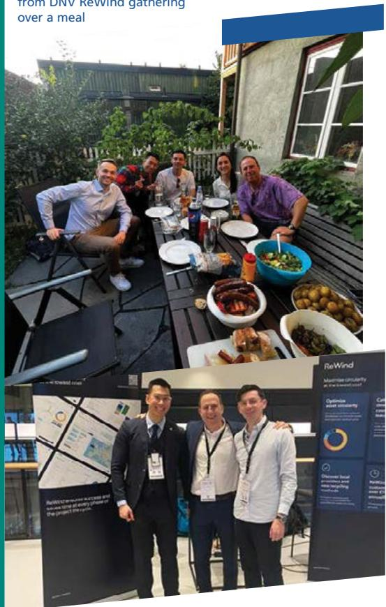  
Bryan and his team attending EoLIS 2023 Conference @ Rotterdam, Netherlands

# SCHOLARSHIPS & AWARDS

Apart from numerous NUS-level scholarships, the NUS Business School also offers many of its own scholarships to local and international students.

# BURSARIES

To ensure that no deserving student is denied higher education due to financial need, financial aid is offered to eligible students. This can take the form of a loan, bursaries, or work-study assistance.

# TUITION FEES

For more information on tuition fees, please refer to the link below.

FOR MORE ON FINANCIAL AID, SCAN HERE!

  
SCAN HERE TO APPLY TO NUS BBA!

# ADMISSIONS

www.nus.edu.sg/oam/apply-to-nus

# NUS BUSINESS SCHOOL

# LEADING FROM ASIA

At NUS Business School, students take a transformative journey, and make an A.G.I.L.E leap forward through the Academically rigorous and flexible curriculum, diversity of Global and experiential opportunities, Industry-relevant infrastructure, varied options for Leadership development and highly Entrepreneurial environment. Through the full BBA experience, they forge ahead with confidence and future-readiness, prepared to make the most of an increasingly dynamic and unpredictable world.

bba.nus.edu.sg

facebook.com/NUSBusinessSchool/

@nus_bba

https://www.youtube.com/c/NUSBizSchool

NUS Business School

BIZ2 Building Level 5-0,

1 Business Link, Singapore 117592

  
SCAN HERE  
TO FIND OUT MORE