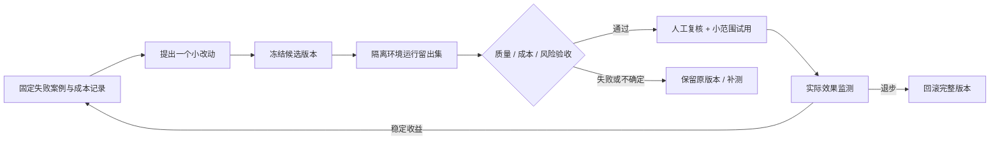

# 面向 RSI 的架构与效率

[中文首页](../README.zh-CN.md) · [English overview](../README.md) · [查询参数](QUERY_RUNTIME.md) · [评测协议](SELF_EVOLUTION_EVALUATION.md)

## 结论

**最终方向是 RSI；现有架构是起点，还不是完整闭环。** 文档证据、可编辑记忆和可控检索适合作为可验证自我改进的基础。当前最大结构性问题是：有多个产生新知识的模块，却没有一个贯通候选版本、独立评测、策略采纳与完整回滚的控制闭环。

因此下一步不是继续增加学习模块，而是把它们收敛为受统一规则约束的候选产生器。文档问答只是第一块试验场，改进对象会从知识与检索策略逐步扩展到改进方法本身。具体见 [RSI 路线图与验收条件](RSI_ROADMAP.md)。

需要优化的目标是：在忠实性不退步的约束下，提高解决任务的能力、减少成本。边数、记忆条数、使用次数只能是过程指标，不能替代这个目标。

## 实际运行的三条流程

| 流程 | 入口与职责 | 边界 |
|---|---|---|
| 在线回答 | UI → FastAPI query → `QueryHarness` → `AgentMemoryCore` / GraphCore → 答案 → 按策略写回 | 请求级开关、证据门禁、上下文预算；不应在此无限学习 |
| 上传与后台整理 | ingest → session RAG → 后台 ECLRR / SelfStudy | 上传后学习不是夜间调度；查询关闭自进化不会取消已经启动的任务 |
| 离线实验与验收 | Neuro consolidation、SEAL/TriGraph 是各自的实验路径；外部 A/B 结果可输入 `assess_evolution_trial` | 实验模块没有直接连接离线门禁；巩固与 TriGraph 未统一接入主 Web 流程；验收工具不自动运行评测或部署 |

当前 Flask UI 代理与 FastAPI 后端是两个进程。保留它们能降低本轮改动风险；后续如果需要简化部署，可以让同一个 API 进程服务静态前端，但应先测清路由、流式响应和文件上传兼容性。

## 骨架与 LLM 的分工

| 工作 | 当前执行者 | 是否需要生成模型 |
|---|---|---|
| 会话范围、重复检测、开关、预算 | 程序与存储层 | 否 |
| 问题类型初判 | 关键词规则；不确定默认忠实模式 | 否，但启发式会误判，UI 可覆盖 |
| 局部图路径、PPR 排序、MMR 去冗余 | 确定性算法 | 否；种子向量检索可能调用 embedding |
| 文档提取、图像理解、答案表达 | LLM / VLM | 是，取决于所选处理路径 |
| 缺链候选 | 可选、单次、有限输入输出的 LLM 调用 | 默认关闭 |
| 质量与成本验收 | 独立标签 + 配对统计 + 硬门槛 | 验收计算本身不调用 LLM；标签获取可能有人工或评审模型成本 |

不要给每一步都加一个 Agent。只有规则或算法不能可靠完成的语义任务，才值得额外模型调用。

## 本轮落地的收敛与提效

1. **减少重复读取。** NetworkX 批量接口每批只获取一次当前图对象。96 节点 + 256 条边的属性读取，锁 / 重载检查从 352 次变为 2 次；保持返回语义，不新增跨会话缓存。
2. **减少重复评分。** 同一次路径搜索预计算每条边的质量；四边链回归样例的评分次数从 48 变为 4，输出路径一致。PPR 的出边权重和每节点只算一次。
3. **独立 I/O 并行。** 节点和边属性同时读取；失败时取消并等待同伴任务。空种子不读图，达到预算后停止无效扩张。
4. **自学产物不覆盖证据。** SelfStudy 的实体注释、摘要节点、矛盾提示和新边写入审计文件，标记 `audit_only` / `query_eligible=false`，不改原始节点描述。
5. **使用频次不等于事实。** Expanded 候选被答案提到可以增加活跃度，但不能因此自动覆盖原节点、去掉候选标签、生成正式共现边。推导关系的受控晋升保留单独的 ECLRR 门禁与写回路径；原文提取不走这条路径，单独的 Judge 角色也不等于独立评测。
6. **独立验收而非自评分晋升。** 新离线工具按忠实、路径、探索分别检查质量、无依据主张、失败、tokens 和耗时；平均收益不能掩盖某类问题退步。

以上操作数是确定性测试结果，不是实际请求加速比。真实时延还取决于网络、embedding、模型生成与文档规模；真实 token 节省需用 provider usage 计量。

既有被污染的描述、历史已晋升节点不会自动被清理。修复防止新的旁路写入；修复历史数据应先备份，再从原文重建或逐项审查。

## 效率边界与验证方法

新增的后台调度按会话合并上传后的学习请求：同会话串行，执行中的重复请求最多保留一次待重跑，不同会话限制同时运行数量。任务由应用生命周期持有并在关闭时取消、等待；它不是持久化队列，进程重启后不会恢复未完成工作。

SelfStudy 的调用封装负责 P1–P6 直接生成调用的估算输入 / 输出预算、调用次数、单次超时；上传的审计模式复用一次图读取，避免每轮无意义重读。计量是保守估算，不是服务商账单；它不覆盖整个上传解析、embedding、ECLRR 或其他模型入口。

上传 SelfStudy 的辅助检索改为固定图快照的词面匹配与来源 chunk 批读，不再经由带隐式关键词 LLM 的查询管线。它降低后台成本，但语义召回弱于向量检索；主用户查询不受影响。节点 / 关系按完整记录选择，超长记录整条略过；chunk 摘录保留来源、字符偏移和截断标记。默认自学最多 24 次直接生成调用、每次预留 2,048 输出 token、单次超时 30 秒；上传路径总估算准入预算为 30,000。模型回调不支持输出上限时，无法预先保证服务商实际输出，只能在收到结果后终止后续工作。

超时依赖模型回调协作取消，不能硬终止持续不响应取消的调用；晚返回不会被判为成功。每次 `run_session` 的用量应读取对应结果的 `llm_usage`；`last_llm_usage` 只是最后完成操作的共享快照。后台日志展示停止原因和用量，仍不是持久化的费用账本。

24 次指直接模型回调次数，不等于服务商请求数：底层重试、多模型回退尚未逐次计量。即使回调接受 `max_tokens`，也只能记录“已请求限制”，不能证明服务商执行了上限。

| 环节 | 已做 | 仍需测量 / 改进 |
|---|---|---|
| 请求热路径 | 局部图预算、批量 I/O、请求内评分复用、精简上下文 | 大图内存、p50 / p95 时延、不同文档规模下的真实质量与费用 |
| 后台学习 | 同会话请求合并、串行、跨会话限并发；SelfStudy 准入预算 | 可恢复作业、统一 usage 账本、ECLRR 端到端预算、异常重试策略 |
| 数据一致性 | session 范围隔离、候选审计不覆盖原文 | 上传仍可能与学习读取并行；尚无图 / 向量 / 记忆的一致性版本快照 |
| 文档与图更新 | 已有分块、持久存储与查询缓存 | 增量提取、图变化版本驱动的缓存失效、批量上传的稳定性基准 |
| 部署与研究模块 | 主路径保留 QueryHarness + AgentMemoryCore + GraphCore | Flask / FastAPI 双进程、独立实验模块的边界与依赖仍可精简 |

下一轮性能验收应固定数据快照、服务商、模型、采样配置和查询开关；记录冷 / 热缓存的 p50 / p95、真实 usage、峰值内存、后台队列数、失败率，并分忠实 / 路径 / 探索检查质量。**尚未完成这组真实负载测量，不能宣称“全架构已经高效”。**

## 通向完整 RSI 的关键缺口

“整理更多记忆”是状态更新；“下一轮更会解决问题”才是能力改进；“连改进方法本身也能被可靠改进”才涉及递归。当前代码缺少以下闭环：

| 缺口 | 现状 | 下一步 |
|---|---|---|
| 改进对象没有统一版本 | 图、记忆、prompt、检索参数分散 | 一次实验记录唯一候选版本与父版本；先只优化参数 / 检索策略 |
| 审核不等于独立验证 | ECLRR Generator 与 Judge 角色分开，但上传接线使用同一模型函数 | 固定独立评测集 / rubric；候选生成不能看到留出答案 |
| 评测尚未驱动部署 | 原词面评分无法识别否定与因果；新工具只给建议 | 先人审采纳，再设计可回退的小流量策略切换 |
| 恢复只是局部 | SQLite 记忆有 revision / restore；ECLRR 有写入异常补偿 | 给整轮图、向量、策略更新做一致性快照，验证质量回退 |
| 后台作业不耐重启 | 已有进程内受管、合并、限并发的任务；SelfStudy 有估算预算 | 增加持久化恢复和全入口费用账本，不把进程内调度当作持久化服务 |
| 经验没有完整反馈到策略 | SelfStudy 保存经验，但相关性检索 / 有用性反馈未形成主流程闭环 | 用独立收益记录训练或选择下一轮策略，而非奖励候选数量 |

本轮**没有**启用自动改代码、改模型权重或自动部署，也没有增加常驻夜间任务。离线验收不能替代这些缺失模块，更不能证明持续自我改进已经发生。

## 下一阶段：最小可验证改进闭环（设计，尚未完整实现）

先把“一个改动确实有用”做扎实，再尝试自动提出下一轮改动。这样可以促进可控的系统级自我改进研究，同时避免把反复生成的错误当成学习成果。

## 研究参照

此处的 RSI 判断是对仓库调用链的工程分析，不是论文结果复现。DGM 用修改 Agent 代码与实证评测研究自我改进；SEAL 研究生成自适应数据与模型更新。仓库中的同名 `SEAL` 模块只代表本项目实现，不能据此声称复现这些能力。参见 [DGM 原论文](https://arxiv.org/abs/2505.22954)、[SEAL 原论文](https://arxiv.org/abs/2506.10943)。
