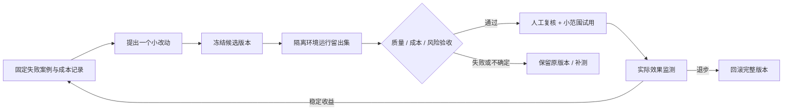

# 架构、效率与 RSI 边界

[中文首页](../README.zh-CN.md) · [English overview](../README.md) · [查询参数](QUERY_RUNTIME.md) · [评测协议](SELF_EVOLUTION_EVALUATION.md)

## 结论

**方向合理，职责仍需收敛。** 文档证据、可编辑记忆和可控检索是合适的基础；多个学习模块不应各自拥有把推测写成事实的权力。当前实现更准确的定位是“可持续整理知识的 Agent 运行时”，而不是已验证的递归自我改进（RSI）。

需要优化的目标是：在忠实性不退步的约束下，提高解决任务的能力、减少成本。边数、记忆条数、使用次数只能是过程指标，不能替代这个目标。

## 实际运行的三条流程

| 流程 | 入口与职责 | 边界 |
|---|---|---|
| 在线回答 | UI → FastAPI query → `QueryHarness` → `AgentMemoryCore` / GraphCore → 答案 → 按策略写回 | 请求级开关、证据门禁、上下文预算；不应在此无限学习 |
| 上传与后台整理 | ingest → session RAG → 后台 ECLRR / SelfStudy | 上传后学习不是夜间调度；查询关闭自进化不会取消已经启动的任务 |
| 离线实验 | Neuro consolidation、SEAL/TriGraph、外部 A/B 结果 → `assess_evolution_trial` | 巩固与 TriGraph 未统一接入主 Web 流程；验收工具不自动运行评测或部署 |

当前 Flask UI 代理与 FastAPI 后端是两个进程。保留它们能降低本轮改动风险；后续如果需要简化部署，可以让同一个 API 进程服务静态前端，但应先测清路由、流式响应和文件上传兼容性。

## 骨架与 LLM 的分工

| 工作 | 当前执行者 | 是否需要生成模型 |
|---|---|---|
| 会话范围、重复检测、开关、预算 | 程序与存储层 | 否 |
| 问题类型初判 | 关键词规则；不确定默认忠实模式 | 否，但启发式会误判，UI 可覆盖 |
| 局部图路径、PPR 排序、MMR 去冗余 | 确定性算法 | 否；种子向量检索可能调用 embedding |
| 文档提取、图像理解、答案表达 | LLM / VLM | 是，取决于所选处理路径 |
| 缺链候选 | 可选、单次、有限输入输出的 LLM 调用 | 默认关闭 |
| 质量与成本验收 | 独立标签 + 配对统计 + 硬门槛 | 验收计算本身不调用 LLM；标签获取可能有人工或评审模型成本 |

不要给每一步都加一个 Agent。只有规则或算法不能可靠完成的语义任务，才值得额外模型调用。

## 本轮落地的收敛与提效

1. **减少重复读取。** NetworkX 批量接口每批只获取一次当前图对象。96 节点 + 256 条边的属性读取，锁 / 重载检查从 352 次变为 2 次；保持返回语义，不新增跨会话缓存。
2. **减少重复评分。** 同一次路径搜索预计算每条边的质量；四边链回归样例的评分次数从 48 变为 4，输出路径一致。PPR 的出边权重和每节点只算一次。
3. **独立 I/O 并行。** 节点和边属性同时读取；失败时取消并等待同伴任务。空种子不读图，达到预算后停止无效扩张。
4. **自学产物不覆盖证据。** SelfStudy 的实体注释、摘要节点、矛盾提示和新边写入审计文件，标记 `audit_only` / `query_eligible=false`，不改原始节点描述。
5. **使用频次不等于事实。** Expanded 候选被答案提到可以增加活跃度，但不能因此自动覆盖原节点、去掉候选标签、生成正式共现边。正式证据关系仍走独立 ECLRR 写回路径。
6. **独立验收而非自评分晋升。** 新离线工具按忠实、路径、探索分别检查质量、无依据主张、失败、tokens 和耗时；平均收益不能掩盖某类问题退步。

以上操作数是确定性测试结果，不是实际请求加速比。真实时延还取决于网络、embedding、模型生成与文档规模；真实 token 节省需用 provider usage 计量。

既有被污染的描述、历史已晋升节点不会自动被清理。修复防止新的旁路写入；修复历史数据应先备份，再从原文重建或逐项审查。

## 为什么还不是完整 RSI？

“整理更多记忆”是状态更新；“下一轮更会解决问题”才是能力改进；“连改进方法本身也能被可靠改进”才涉及递归。当前代码缺少以下闭环：

| 缺口 | 现状 | 下一步 |
|---|---|---|
| 改进对象没有统一版本 | 图、记忆、prompt、检索参数分散 | 一次实验记录唯一候选版本与父版本；先只优化参数 / 检索策略 |
| 审核不等于独立验证 | ECLRR Generator 与 Judge 角色分开，但上传接线使用同一模型函数 | 固定独立评测集 / rubric；候选生成不能看到留出答案 |
| 评测尚未驱动部署 | 原词面评分无法识别否定与因果；新工具只给建议 | 先人审采纳，再设计可回退的小流量策略切换 |
| 恢复只是局部 | SQLite 记忆有 revision / restore；ECLRR 有写入异常补偿 | 给整轮图、向量、策略更新做一致性快照，验证质量回退 |
| 后台作业不耐重启 | 进程内后台任务；未统一持久化调度、总费用账本 | 作业可恢复、可取消、有限预算；不要先堆更多学习模块 |
| 经验没有完整反馈到策略 | SelfStudy 保存经验，但相关性检索 / 有用性反馈未形成主流程闭环 | 用独立收益记录训练或选择下一轮策略，而非奖励候选数量 |

本轮**没有**启用自动改代码、改模型权重或自动部署，也没有增加常驻夜间任务。离线验收不能替代这些缺失模块，更不能证明持续自我改进已经发生。

## 建议的最小闭环（后续方向，不是已实现）

先把“一个改动确实有用”做扎实，再尝试自动提出下一轮改动。这样可以促进可控的系统级自我改进研究，同时避免把反复生成的错误当成学习成果。

## 研究参照

此处的 RSI 判断是对仓库调用链的工程分析，不是论文结果复现。DGM 用修改 Agent 代码与实证评测研究自我改进；SEAL 研究生成自适应数据与模型更新。仓库中的同名 `SEAL` 模块只代表本项目实现，不能据此声称复现这些能力。参见 [DGM 原论文](https://arxiv.org/abs/2505.22954)、[SEAL 原论文](https://arxiv.org/abs/2506.10943)。
