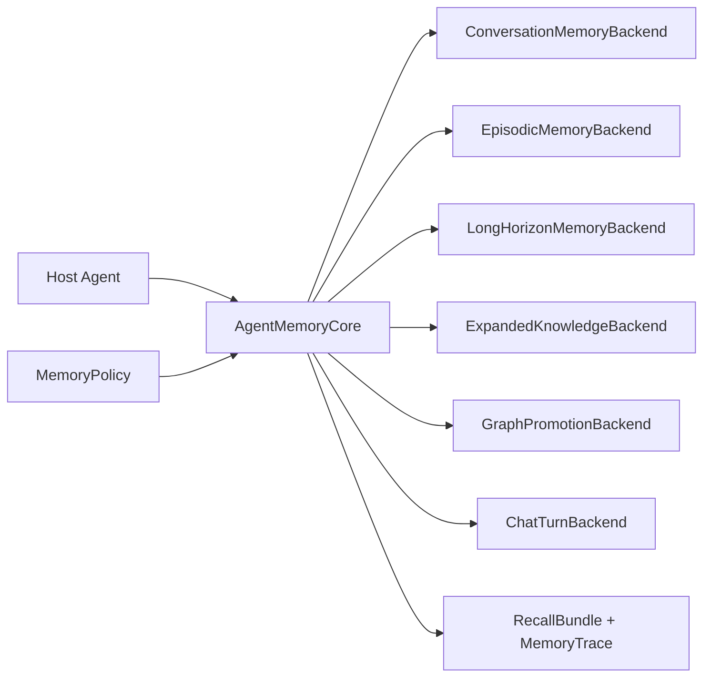

# DocThinker Memory Plugin Guide

DocThinker exposes its agentic memory layer as a small set of backend
protocols. A host agent can bring its own database, vector store, graph store,
or memory service and still use the same recall/consolidation flow.

## Runtime Shape



## Backend Contracts

- `ConversationMemoryBackend`: builds short/long conversation context before
  generation and consolidates the final turn afterward.
- `EpisodicMemoryBackend`: retrieves similar past episodes as analogy context
  and writes the completed turn as a new episode.
- `LongHorizonMemoryBackend`: builds a recall plan, retrieves durable
  cross-turn insights, and consolidates useful answers into long-horizon
  memory.
- `ExpandedKnowledgeBackend`: matches candidate KG hypotheses during recall and
  records which candidates were useful in the answer.
- `GraphPromotionBackend`: promotes repeatedly useful expanded nodes into the
  authoritative graph.
- `ChatTurnBackend`: optionally forwards Q&A turns into another ingestion
  pipeline.

Implement only the layers your agent needs. `AgentMemoryBackends` accepts
`None` for every layer.

## Policy

Use `MemoryPolicy` to tune behavior without changing backend code:

- `enabled_layers`: exact layers active for recall/consolidation.
- `episodic_top_k`: number of analogy episodes to retrieve.
- `expanded_top_k`: number of expanded KG candidates to match.
- `expanded_min_score`: minimum expanded-node match score.
- `expanded_instruction_limit`: number of expanded candidates allowed in the
  generated retrieval instruction.
- `long_horizon_top_k`: number of durable insights to retrieve.
- `long_horizon_min_confidence`: minimum confidence for long-horizon recall.
- `long_horizon_scopes`: scopes to search, such as `session`, `project`, and
  `user`.
- `long_horizon_write_scope`: where newly consolidated insights are stored.
- `answer_entity_limit`: max entities extracted from a completed Q&A turn.

## Minimal Integration

```python
from docthinker.memory_core import AgentMemoryBackends, AgentMemoryCore, MemoryPolicy

memory = AgentMemoryCore(
    backends=AgentMemoryBackends(
        conversation=my_conversation_backend,
        episodic=my_episode_backend,
    ),
    policy=MemoryPolicy(
        episodic_top_k=3,
        enabled_layers=("conversation", "episodic"),
    ),
)

bundle = await memory.recall(
    session_id="session-1",
    query=user_query,
    base_instruction=system_instruction,
    enable_thinking=True,
)

answer = await agent.run(user_query, context=bundle.retrieval_instruction)

await memory.after_response(
    session_id="session-1",
    question=user_query,
    answer=answer,
    matched_expanded=bundle.expanded_matches,
)
```

See `packages/docthinker-memory/examples/custom_backend.py` for a runnable
in-memory backend.
