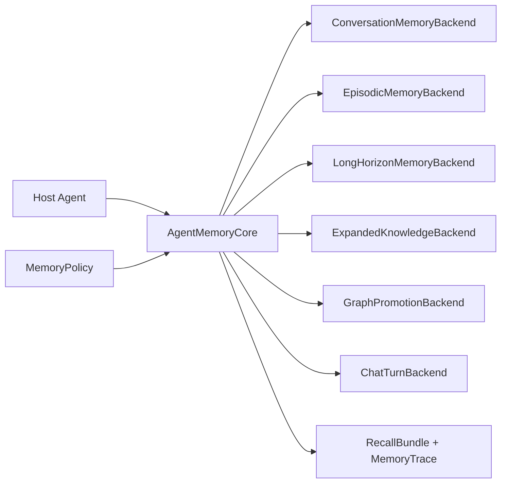

# DocThinker Memory Plugin Guide

DocThinker exposes its agentic memory layer as a small set of backend
protocols. A host agent can bring its own database, vector store, graph store,
or memory service and still use the same recall/consolidation flow.
The default adapters include Claw/OpenClaw-style conversation memory, but the
core API is backend-agnostic.

## Runtime Shape



## Backend Contracts

- `ConversationMemoryBackend`: builds short/long conversation context before
  generation and consolidates the final turn afterward.
- `EpisodicMemoryBackend`: retrieves similar past episodes as analogy context
  and writes the completed turn as a new episode.
- `LongHorizonMemoryBackend`: builds a recall plan, retrieves durable
  cross-turn insights, reasons over recalled memory, consolidates useful
  answers into long-horizon memory, and exposes auditable list/delete/export
  controls.
- `ExpandedKnowledgeBackend`: matches candidate KG hypotheses during recall and
  records which candidates were useful in the answer.
- `GraphPromotionBackend`: promotes repeatedly useful expanded nodes into the
  authoritative graph.
- `ChatTurnBackend`: optionally forwards Q&A turns into another ingestion
  pipeline.

Implement only the layers your agent needs. `AgentMemoryBackends` accepts
`None` for every layer.

## Policy

Use `MemoryPolicy` to tune behavior without changing backend code:

- `enabled_layers`: exact layers active for recall/consolidation.
- `episodic_top_k`: number of analogy episodes to retrieve.
- `expanded_top_k`: number of expanded KG candidates to match.
- `expanded_min_score`: minimum expanded-node match score.
- `expanded_instruction_limit`: number of expanded candidates allowed in the
  generated retrieval instruction.
- `long_horizon_top_k`: number of durable insights to retrieve.
- `long_horizon_min_confidence`: minimum confidence for long-horizon recall.
- `long_horizon_scopes`: scopes to search, such as `session`, `project`, and
  `user`.
- `long_horizon_write_scope`: where newly consolidated insights are stored.
- `allow_memory_writes`: global switch for after-response consolidation.
- `write_excluded_layers`: layers that should never receive writes under this
  policy.
- `answer_entity_limit`: max entities extracted from a completed Q&A turn.

Per request, hosts can also pass `remember_turn=false` or
`memory_excluded_layers=["episodic", "long_horizon"]` through DocThinker's
query API. This keeps the framework controllable: sensitive text, temporary
drafts, or low-confidence interactions can be answered without becoming memory.

The default long-horizon backend borrows the strongest memory-management ideas
from file-based agent memory systems while keeping DocThinker's agentic runtime:

- It records the latest write decision (`store`, `update`, `skip`, or
  `delete`) so UI and hosts can explain why something became memory.
- It skips obvious secrets such as API keys, tokens, passwords, and cloud
  credentials.
- It avoids transient debug logs, temporary file paths, git history, and
  one-off verification details unless the user explicitly asks to remember
  them.
- It can plan natural-language edits, list/update/delete individual memories,
  and export a `MEMORY.md` index for review or portability.

Natural-language memory editing is intentionally two-step. The planner maps an
instruction to candidate memories with a token/embedding fallback and returns a
suggested patch. The UI then highlights related graph nodes and edges, lets the
user choose a candidate, and only mutates memory after explicit confirmation.

## Minimal Integration

```python
from docthinker.memory_core import AgentMemoryBackends, AgentMemoryCore, MemoryPolicy

memory = AgentMemoryCore(
    backends=AgentMemoryBackends(
        conversation=my_conversation_backend,
        episodic=my_episode_backend,
    ),
    policy=MemoryPolicy(
        episodic_top_k=3,
        enabled_layers=("conversation", "episodic"),
    ),
)

bundle = await memory.recall(
    session_id="session-1",
    query=user_query,
    base_instruction=system_instruction,
    enable_thinking=True,
)

answer = await agent.run(user_query, context=bundle.retrieval_instruction)

await memory.after_response(
    session_id="session-1",
    question=user_query,
    answer=answer,
    matched_expanded=bundle.expanded_matches,
)
```

See `packages/docthinker-memory/examples/custom_backend.py` for a runnable
in-memory backend.
