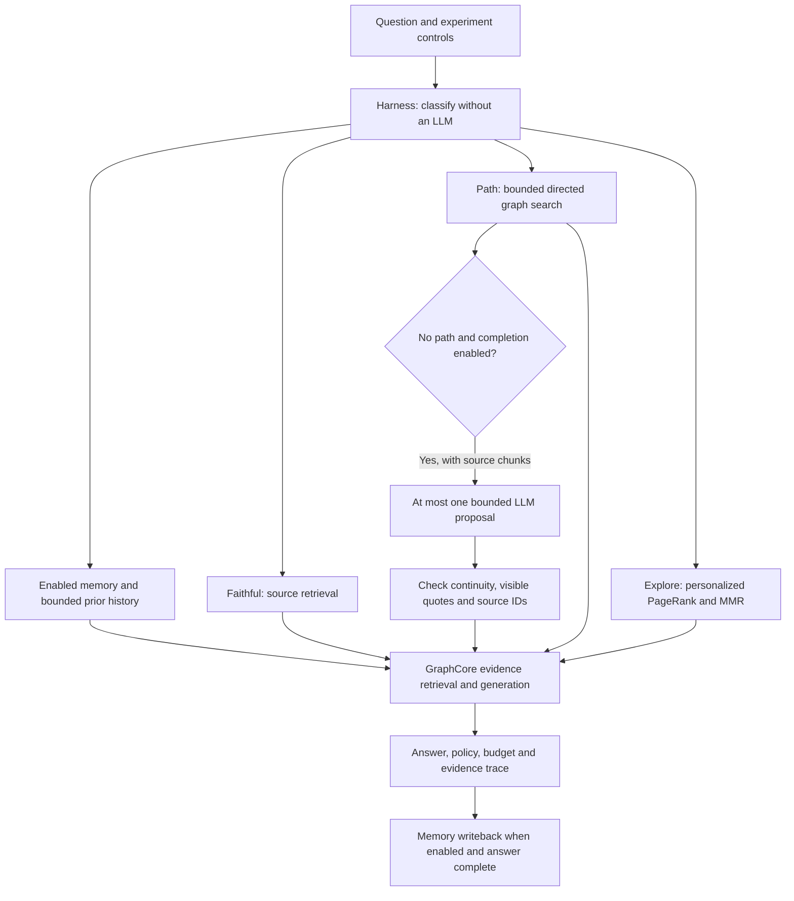

# Query controls and evidence boundaries

The query Harness chooses a policy and bounds optional context before the existing memory and GraphCore components generate an answer. This is query-time control; document ingestion and experimental offline consolidation remain separate workflows.



## Modes

| `evolution_mode` | Behavior |
|---|---|
| `auto` | Uses keyword rules; uncertain questions default to faithful. No classifier LLM call. |
| `faithful` | Suppresses expanded-node/cognition recall and inferred graph relations. A missing-evidence response does not trigger an unrestricted document answer. |
| `path` | Searches a directed local graph for continuous paths. Broad inferred-relation retrieval stays closed. Selected paths cite source IDs and available quotes. |
| `explore` | Ranks neighboring concepts with personalized PageRank and diversifies with MMR; enables optional expanded/cognition recall. Inferred concepts remain hypotheses. |
| `off` | Disables use of evolution knowledge for this query. It does not cancel ingestion jobs. |

`use_self_evolution=false` overrides evolution usage without relaxing an explicit faithful question's evidence requirement. `include_discovered_edges=false` is honored in every graph path. If enabled, only ECLRR-v4 promoted relations that pass the shared evidence gate may participate. This gate checks provenance and review metadata; it is not independent proof of a causal claim.

Ordinary conversation and memory questions can use available history and recalled memory without requiring an uploaded document. Streaming and non-streaming routes share the same controls and fallback rules.

## Cost controls

`adaptive_context=true` applies the following initial engineering caps. Explicit smaller request values always win. These caps are not claimed to be optimal for every dataset.

| Policy | Entity/relation candidates (`top_k`) | Chunks | Relations | Relation tokens | Text input limit |
|---|---:|---:|---:|---:|---:|
| faithful | 12 | 8 | 16 | 2,400 | 12,000 |
| path | 20 | 12 | 24 | 4,000 | 18,000 |
| explore | 16 | 10 | 24 | 3,200 | 16,000 |

- `max_history_tokens=1200` and `max_auxiliary_tokens=2000` bound history and memory/path instructions. They shrink further for small total budgets. The current question is not duplicated in history. Oversized paths are omitted whole rather than cut mid-chain.
- `adaptive_context=false` restores the request's retrieval caps; history/instruction limits still apply.
- KG/naive text generation counts the rendered prompt, question, history and a framing reserve together. It removes complete low-ranked records to fit; if necessary instructions or any usable evidence cannot fit, it returns `context_budget_exceeded` without generating an answer or writing that failure into memory. Image-provider token accounting is separate from this text limit.
- Path/exploration reads start from at most 8 vector seeds, expand 4 neighborhoods, and retain at most 96 nodes / 256 edges. This can miss valid paths; diagnostics describe a bounded search, not the absence of evidence in the document.
- `enable_path_completion=false` is the default. When enabled, a failed path search with usable anchors and chunks may invoke one LLM proposal. The prompt is at most 6,000 characters; output requests at most 1,200 tokens; the call times out after 18 seconds. Only quotes from the visible prompt are accepted. The proposal is query-local, not written into the graph.
- Vector seeding can call an embedding provider. Memory operations and answer generation retain their existing model requirements; the algorithmic routing itself does not call an LLM.

API responses and SSE metadata expose `question_policy`, `graph_reasoning`, and `context_budget`. Counts use the configured tokenizer, or conservative UTF-8 byte counts when unavailable. They are not provider billing measurements. The UI's advanced controls expose the modes, compact-context toggle, audited-relation opt-in, and model-completion opt-in.

## Isolation and reproducible comparisons

Local JSON status/KV, graph and vector stores share data/locks/update notifications only when their canonical storage directories match. Pipeline status uses the same directory scope. Old sessions with an empty workspace remain in their existing file layout and are isolated from other directories. This prevents new cross-session contamination; already missing or incorrectly processed legacy documents may need re-indexing.

`use_memory=false` disables recall and post-answer memory writes. `use_conversation_context=false` disables ordinary history injection, while separately enabled long-term memory remains available. UI chat logs are retained. `remember_turn=false` keeps recall but disables post-answer memory writes. API queries use the controlled `after_response` writer and suppress the SDK's legacy unconditional question/answer log; direct SDK callers can set `record_knowledge=false` too.

`use_llm_cache=false` bypasses query and media-description cache reads/writes. Answer cache identity includes the prompt, history, model and retrieval controls. Media descriptions may be reused when caching is on, but current graph evidence is retrieved again; cached media answers no longer bypass retrieval.

For an original-source baseline, use this body with `POST /api/v1/query` (or `/query/stream`):

```json
{
  "session_id": "#00003",
  "question": "原文如何描述能源安全？",
  "use_memory": false,
  "use_conversation_context": false,
  "use_llm_cache": false,
  "remember_turn": false,
  "use_self_evolution": false,
  "evolution_mode": "faithful",
  "include_discovered_edges": false,
  "enable_path_completion": false,
  "adaptive_context": true
}
```

For a controlled comparison, keep the document snapshot, model, question and explicit budgets fixed; use `adaptive_context=false` if comparing algorithms at identical retrieval limits. Change one feature at a time. Record actual provider tokens, latency, cited-source support, missing key points, and unsupported claims separately. Exclude failed ingestion and pending-processing answers from answer-quality scores.

`score_reasoning_paths` reports node/hop coverage, continuity and citation presence. `verified_quote_hop_rate` requires independently supplied `source_chunks` and only tests quote inclusion, not entailment. A path or keyword coverage score alone does not establish answer correctness. Unit tests use synthetic evidence and model doubles; real-dataset quality and token savings still require an A/B run.

Run the same test dependency set as CI from a clean Python environment:

```sh
python -m pip install -e ".[all,test]"
python -m pytest tests/ -q --ignore=tests/debug_db.py
```
