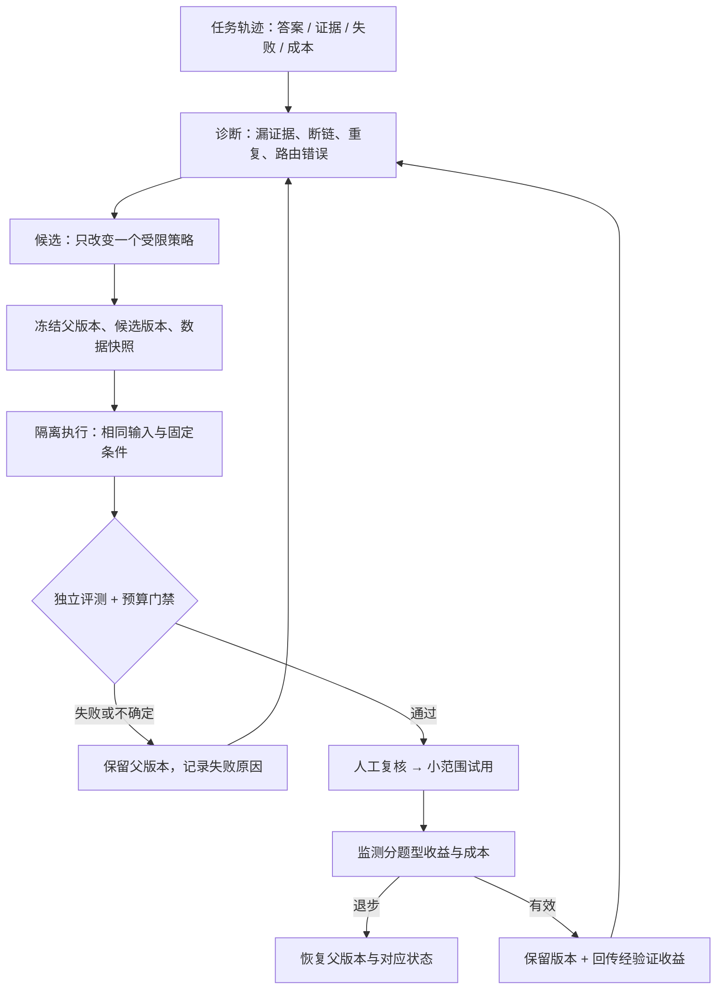

# DocThinker：通向 RSI 的实施路线

[中文首页](../README.zh-CN.md) · [English overview](../README.md) · [现有架构](ARCHITECTURE.md) · [评测协议](SELF_EVOLUTION_EVALUATION.md)

## 核心问题

**同一个系统，怎样利用自己的任务经验，持续改进解决问题的方法，最后也改进“寻找有效改进”的方法？**

这里的 RSI 指递归自我改进。文档、图谱和记忆是可检查的试验场，不是研究终点。先研究固定模型下的系统级改进：路由、检索、路径选择、工具与上下文组织。没有必要让模型权重更新成为第一步的前提。

这是一份实施设计，不是已实现能力声明；状态以仓库接线和独立实验结果为准。

## 三种变化，不要混成一个“自进化”

| 层次 | 改变什么 | 怎样证明有用 | 当前状态 |
|---|---|---|---|
| 知识整理 | 记忆、摘要、关系候选 | 新信息可追溯，忠实回答不被污染 | 有实现，收益仍需独立测量 |
| 能力改进 | 检索与控制策略、prompt、工具 | 同一留出任务下质量提高或成本下降 | 有可控执行骨架和离线门禁，缺版本采纳闭环 |
| 递归改进 | 提出候选、选择实验的方法本身 | 相同总实验预算下，更快找到可迁移的有效改动 | 研究目标，尚未实现 |

例如：夜间生成了 100 条边，只说明产生了候选；调整路径选择后，多跳题在新文档上稳定提高，才是能力改进；下一轮更善于定位值得调整的策略，才开始触及递归。

## 先收敛成一个控制闭环

不再让每个学习模块都单独拥有“生成—自评—写入正式状态”的完整权限。保留它们作为候选产生器，把执行、评价、版本管理收敛到共同契约。

上图是目标闭环。当前只有部分任务轨迹、策略执行、候选生成和独立标签的离线门禁；尚无统一的候选版本注册、隔离运行器、线上采纳和整体回滚。

### 先改什么，暂时不改什么

第一轮只开放小型白名单策略空间：每类问题的召回数量、关系上限、MMR 去冗余系数、路径长度与输入预算。候选必须通过 schema 校验，不能突破外部设置的资源上限。先用确定性的网格 / 局部搜索产生候选，避免每次试验先消耗一次 LLM。

暂不自动改源文档、评分标准、留出答案、权限、费用上限、线上代码或模型权重。候选生成器可以提出关于这些对象的研究建议，但不能自行扩大可修改范围。

最小实验记录应包含：

| 字段组 | 必须记录 |
|---|---|
| 版本 | 候选 ID、父版本、代码提交、策略内容哈希 |
| 固定条件 | 文档 / 图快照、数据集拆分、模型与 embedding 版本、prompt 版本、缓存和记忆开关 |
| 运行 | 逐题答案、证据 IDs、错误、实际 usage、时延、随机种子 / 采样配置 |
| 判定 | 独立评审与 rubric 版本、逐题分数、分题型差值、不确定性、拒绝原因 |
| 生命周期 | 提议、测试、待复核、试用、采用、回滚；执行人和时间 |

这是未来的记录契约。现有 `assess_evolution_trial` 的输入只覆盖其中的配对评测部分，不负责存储或验证运行环境。

## 算法与 LLM：骨架和语义的分工

| 步骤 | 第一选择 | 何时才用 LLM |
|---|---|---|
| 找浪费 | 统计重复 chunk、未被引用上下文、费用与时延 | 解释复杂失败模式时 |
| 找断链 | 有向局部图搜索，标记缺失节点和来源 | 原文隐含关系难以直接抽取时，提出可审查候选 |
| 产生策略候选 | 白名单内网格 / 局部搜索，一次只改一组变量 | 算法候选反复失败，需提出新的语义假设时 |
| 挑选上下文 | 相关性排序、MMR、来源去重、路径预算 | 无须每个 chunk 都让 LLM 打分 |
| 比较策略 | 分题型配对统计 + 硬约束 + 不确定性 | 获取独立语义评分时；不能用候选自己的自评分晋升 |
| 选择下一轮实验 | 基于验证收益与成本的优先级；数据足够后再考虑 bandit | 不默认用另一个 Agent 长篇讨论决策 |

候选的优先级可定义为 `预期任务收益 × 当前不确定性 / 预计验证成本`。这是调度启发式，不是事实真伪评分，也不是已接入的训练算法。得到足够的独立试验记录后，才能检验它是否优于随机或固定轮询。

### 如何保留发散，同时避免污染

忠实、路径、探索三个模式分别评测。忠实模式以原文支持为硬约束；路径模式奖励被证据覆盖的连续推理；探索模式允许多样性，但无来源的想法必须保留假设标签。

不能让探索题的高分掩盖忠实题的退步；也不能为追求统一措辞，抹掉探索模式的价值。重排序解决“先看什么”，证据审核解决“能否当真”，两者不能互相替代。用大字号图片编码 chunk 权重不是当前优先方案：它增加渲染 / 视觉理解成本，却不直接解决证据支持和缺链。

## 四个里程碑与完成条件

| 阶段 | 交付物 | 完成条件 |
|---|---|---|
| M0：可信、有限的任务运行时 | 隔离、证据标记、可控上下文、预算、可观察轨迹 | 跨会话与预算回归通过；真实文档上有忠实 / 路径 / 探索三类基线。工程基础已有，真实效果基线未完成 |
| M1：一次改进可验证 | 策略候选版本、隔离 A/B 运行器、独立验收、人工采纳、对应状态回滚 | 对一个策略改动可复现其收益；注入退步能拒绝；采纳后能恢复父版本。当前最优先 |
| M2：多轮受控自我改进 | 失败反馈、候选选择、有限预算实验队列 | 多轮改善在未参与候选搜索的新文档上仍成立；计入全部生成与验证成本后有净收益 |
| M3：改进机制本身的改进 | 可版本化的诊断器 / 候选产生器 / 搜索策略 | 相同预算下，优于固定搜索基线；外部验证规则与安全边界不由被评系统自行放宽 |

M3 是 RSI 研究的重要证据，但不等于证明了无限、通用或持续加速的自我改进。

## 评测不要奖励错目标

1. **分开候选开发集与最终留出集。** 开发集可以用于诊断；留出集的答案不进入候选上下文。多次挑选最优候选会对同一验证集过拟合，最终应使用未触碰的审计集。
2. **保留失败与成本。** 失败不能从均值里消失；背景提案、embedding、评审、重试也属于实验成本。
3. **使用外部标签。** 语义支持、因果完整性与无依据主张不能只看关键词重合。评审模型是工具，不能仅凭“两个角色 prompt”声称独立。
4. **比较总净收益。** 一个昂贵的改动应在预期后续任务量中回本；暂时更省输入 token 不代表总成本更低。
5. **先人审，再考虑自动采纳。** 验证系统不能为了通过测试修改自己的题目、阈值或权限。

现有 [离线门禁](SELF_EVOLUTION_EVALUATION.md) 是起点，`recommend_review` 仅表示建议复核，不是批准部署，也不是统计学意义上的 RSI 证明。

## 研究参照

[Darwin Gödel Machine](https://arxiv.org/abs/2505.22954) 将 Agent 代码修改与实证任务评测结合；[SEAL](https://arxiv.org/abs/2506.10943) 研究自生成适应数据与模型更新。这里借鉴的是“改动必须由任务效果验证”的思想，不声称复现其结果。仓库中的同名模块也不等于论文实现。
